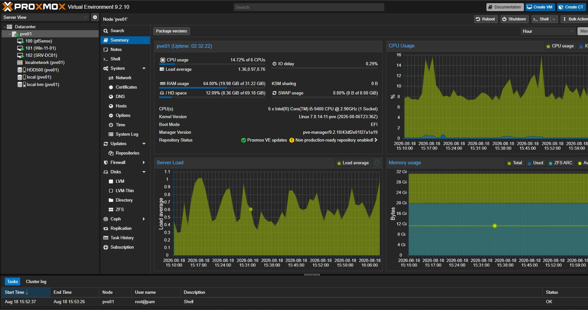

# 🖥️ Proxmox VE Virtualization

## 📌 Overview

Proxmox VE is the primary virtualization platform used in my Enterprise HomeLab.

The objective of this stage was to build a flexible virtualization environment where I could deploy and manage multiple operating systems, servers, firewalls, and client machines while gaining practical experience with enterprise virtualization concepts.

The Proxmox environment is used to host services including:

- pfSense Firewall
- Windows Server 2025
- Windows 11 Client
- Linux virtual machines
- Future monitoring and infrastructure services

---

## 🎯 Objectives

The main objectives of the Proxmox deployment were:

- Install and configure a bare-metal hypervisor
- Configure Proxmox management networking
- Understand Linux bridges and virtual networking
- Deploy and manage virtual machines
- Configure additional storage
- Create dedicated backup storage
- Deploy Windows and firewall virtual machines
- Learn VM resource allocation
- Practice VM backup and recovery
- Prepare the environment for future multi-node clustering

---

## 🖥️ HomeLab Hardware

### Primary Proxmox Host

| Component | Configuration |
|---|---|
| System | Lenovo M720t Tower |
| Processor | Intel Core i5 |
| Memory | 32 GB RAM |
| Primary Storage | SSD |
| Additional Storage | 500 GB SATA HDD |
| GPU | NVIDIA dedicated GPU |
| Hypervisor | Proxmox VE |

Two Lenovo M910q Mini PCs are available for future expansion of the Proxmox environment, including clustering and multi-node infrastructure testing.

---

## 🌐 Proxmox Networking

The Proxmox host uses a Linux bridge to provide network connectivity to virtual machines.

### Basic Concept

```text
Physical NIC
     |
     |
   vmbr0
     |
     +-------------------+
     |         |         |
  pfSense   Server VM   Client VM
```

The bridge allows virtual machines to communicate through the physical network interface while remaining managed by the Proxmox hypervisor.

The primary Proxmox management interface is accessed through the web-based management console.

---

## 💾 Storage Configuration

The HomeLab uses separate storage for virtual machines and backups.

### Primary Storage

Used for:

- Proxmox system files
- Virtual machine disks
- ISO images
- VM templates

### Additional 500 GB HDD

An additional SATA HDD was added to the Proxmox host and configured as dedicated storage.

The disk is used primarily for:

- Virtual machine backups
- Infrastructure backups
- Recovery testing

Separating backup storage from the primary VM storage provides additional flexibility when testing backup and recovery procedures.

---

## 🧪 Virtual Machines

Several virtual machines were created as part of the HomeLab.

| Virtual Machine | Purpose |
|---|---|
| pfSense | Firewall, routing, VPN and network security |
| Windows Server 2025 | Active Directory and infrastructure services |
| Windows 11 Client | Domain client and Group Policy testing |
| Linux VMs | Linux administration and future services |

---

## 🔥 pfSense VM

pfSense was deployed as a virtual machine within Proxmox.

The VM provides networking and security functionality including:

- Firewall policies
- LAN/WAN routing
- NAT
- DNS
- DHCP testing
- Dynamic DNS
- WireGuard VPN
- Remote HomeLab access

Virtual network interfaces were assigned to pfSense to separate WAN and internal Lab traffic.

Detailed pfSense configuration will be documented separately in the pfSense section of this repository.

---

## 🪟 Windows Server 2025 VM

Windows Server 2025 was deployed as a Proxmox virtual machine to provide enterprise infrastructure services.

The server is used for:

- Active Directory Domain Services
- DNS
- DHCP
- Group Policy
- Certificate Services
- Windows Event Collection
- Backup and recovery testing

---

## 💻 Windows 11 Client VM

A Windows 11 virtual machine was deployed as the primary domain client.

VirtIO drivers were installed to provide optimized virtual hardware support.

The client is used to test:

- Active Directory domain joining
- Group Policy
- Microsoft LAPS
- BitLocker
- Windows Firewall policies
- Sysmon
- Windows Event Forwarding
- Remote Desktop
- Enterprise security configurations

---

## 💾 Backup Storage

A dedicated location was created on the additional HDD for Proxmox backups.

This allows virtual machines to be backed up separately from their primary virtual disks.

Backup testing is an important part of the HomeLab because infrastructure administration requires both deployment and recovery capabilities.

---

## 🔧 Troubleshooting & Learning

During the Proxmox deployment, I gained practical experience troubleshooting several areas including:

- Virtual network configuration
- VM network connectivity
- Storage configuration
- Additional disk integration
- Virtual hardware configuration
- Windows VirtIO drivers
- VM boot configuration
- pfSense virtual interfaces
- Remote management connectivity
- VM startup dependencies

These troubleshooting exercises helped develop a better understanding of how virtualization, networking, storage, and operating systems interact.

---

## 🔐 Security Considerations

The Proxmox management interface is not intentionally exposed directly to the public Internet.

Remote HomeLab management is performed through a secure VPN connection using WireGuard and pfSense.

Sensitive information such as passwords, private keys, authentication tokens, recovery keys, and private certificates is not stored in this repository.

---

## 🚀 Future Improvements

Planned improvements include:

- Expand the Proxmox multi-node environment
- Explore Proxmox clustering
- Configure VLAN-based network segmentation
- Improve centralized backup
- Deploy additional Linux servers
- Deploy Docker services
- Implement infrastructure monitoring
- Explore infrastructure automation
- Test high-availability concepts

---

## 📚 Skills Demonstrated

This stage of the project demonstrates practical experience with:

- Proxmox VE
- Type-1 virtualization
- Virtual machine deployment
- Virtual networking
- Linux bridges
- Storage management
- VM backup concepts
- Windows virtualization
- Firewall virtualization
- Infrastructure troubleshooting

---

## 📸 Screenshots

### Proxmox Node Summary

The Proxmox VE node summary provides a centralized view of the virtualization host, including CPU utilization, memory usage, storage status, system load, kernel information, and active virtual machines.



The primary Proxmox host is configured with an Intel Core i5 processor and approximately 32 GB of RAM. The environment currently hosts pfSense, Windows Server 2025, and Windows 11 virtual machines used throughout the HomeLab.

This dashboard is also used to monitor host resource utilization and quickly verify the operational status of the virtual infrastructure.
---

⬅️ [Back to Enterprise HomeLab](../README.md)
