# 🪟 Windows Server 2025 Enterprise HomeLab

## 📌 Overview

Windows Server 2025 is used as the primary Windows infrastructure server within my Enterprise HomeLab.

The server was deployed as a virtual machine on **Proxmox VE** and provides centralized infrastructure services including:

- Active Directory Domain Services (AD DS)
- DNS Server
- DHCP Server
- Group Policy Management
- Active Directory Certificate Services (AD CS)
- Windows LAPS
- Microsoft Defender security policies
- Windows Defender Firewall policies
- BitLocker policies
- Credential Guard / Virtualization-Based Security
- Advanced Audit Policy
- Windows Event Forwarding (WEF)
- Windows Event Collector (WEC)
- Sysmon monitoring
- Active Directory Recycle Bin
- Windows Server Backup

The Windows Server virtual machine is named:

```text
SRV-DC01
```

It was promoted to a Domain Controller and now forms the core of the Windows Active Directory lab environment.

The objective of this stage was not simply to install Windows Server, but to build an enterprise-style Windows infrastructure where identity, networking, security, monitoring, remote administration, and recovery technologies work together.

---

# 🏗️ 1. Server Architecture

Windows Server 2025 is hosted as a virtual machine on the Proxmox VE virtualization platform.

The general infrastructure design is:

```text
Internet
   │
   ▼
ISP Router
   │
   ▼
pfSense Firewall
   │
   ├── Firewall
   ├── NAT
   ├── WireGuard VPN
   ├── Dynamic DNS
   └── DNS Integration
   │
   ▼
HomeLab Network
   │
   ▼
Proxmox VE
   │
   ├── pfSense VM
   │
   ├── Windows 11 Client
   │
   └── SRV-DC01
          │
          ├── Windows Server 2025
          ├── Active Directory Domain Services
          ├── DNS Server
          ├── DHCP Server
          ├── Group Policy
          ├── Active Directory Certificate Services
          ├── Windows LAPS
          ├── Windows Event Collector
          ├── Active Directory Recycle Bin
          └── Windows Server Backup
```

This architecture provides a realistic environment for practicing Windows Server administration while integrating virtualization, networking, security, monitoring, endpoint management, and remote-access technologies.

---

# 💻 2. Virtual Machine Configuration

Windows Server 2025 was deployed as a dedicated virtual machine within Proxmox VE.

## VM Details

| Setting | Configuration |
|---|---|
| VM Name | SRV-DC01 |
| Operating System | Windows Server 2025 |
| Hypervisor | Proxmox VE |
| Firmware | OVMF (UEFI) |
| Machine Type | q35 |
| CPU | 4 vCPU |
| Memory | 8 GB |
| Primary Disk | 80 GB |
| Backup Disk | 50 GB |
| Network Adapter | VirtIO |
| Virtualization Platform | KVM/QEMU |

VirtIO drivers were installed to provide optimized virtual storage and network performance.

The additional **50 GB virtual disk** is used for Windows Server backup and recovery testing.

---

# 🖥️ 3. Windows Server Roles

Windows Server 2025 was configured with the infrastructure roles required by the HomeLab.

The Server Manager dashboard confirms the installation of major server roles including:

- Active Directory Domain Services
- Active Directory Certificate Services
- DHCP Server
- DNS Server
- File and Storage Services

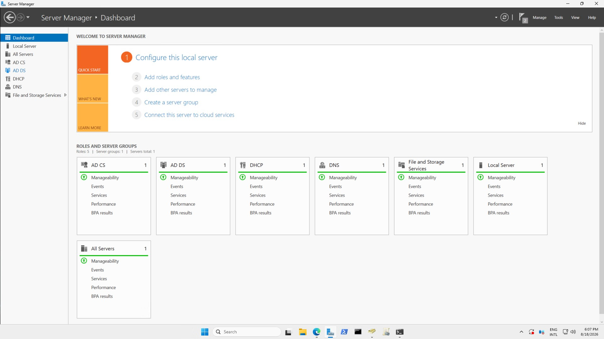

The server is therefore functioning as much more than a basic Windows VM and provides centralized services to the wider HomeLab.

---

# ⚙️ 4. Local Server Configuration

The server hostname is:

```text
SRV-DC01
```

A static network configuration is used because the server provides critical infrastructure services such as Active Directory and DNS.

Remote management and Remote Desktop were enabled for administrative access.

Microsoft Defender Firewall and Microsoft Defender Antivirus remain enabled.

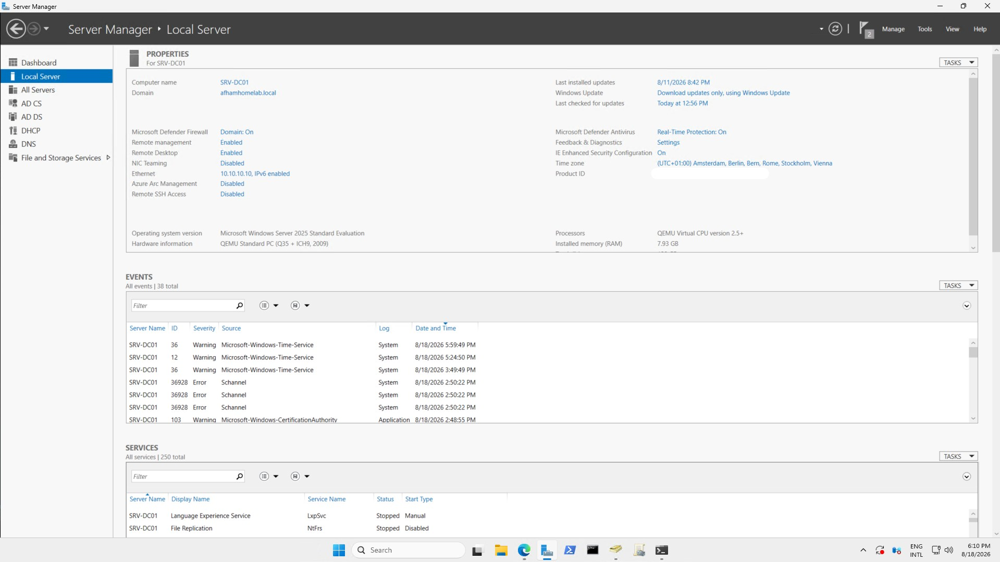

The server can also be administered remotely through the protected WireGuard VPN rather than exposing Remote Desktop directly to the public Internet.

---

# 🌐 5. Network Configuration

SRV-DC01 is connected to the internal HomeLab network through the Proxmox virtual networking infrastructure.

The general path is:

```text
SRV-DC01
    │
    ▼
VirtIO Network Adapter
    │
    ▼
Proxmox Linux Bridge
    │
    ▼
pfSense
    │
    ▼
HomeLab Network
```

pfSense provides routing, firewalling, VPN connectivity and network security, while Windows Server provides centralized Windows infrastructure services.

---

# 👥 6. Active Directory Domain Services

Active Directory Domain Services was installed on SRV-DC01.

The server was subsequently promoted to a Domain Controller.

The lab Active Directory domain is:

```text
afhamhomelab.local
```

Active Directory is used to centrally manage:

- Domain users
- Administrative accounts
- Domain computers
- Organizational Units
- Security groups
- Group memberships
- Authentication
- Authorization
- Group Policy
- Enterprise security configuration

A Windows 11 workstation was successfully joined to the Active Directory domain.

The domain workstation is named:

```text
WIN11-CL01
```

---

# 🗂️ 7. Active Directory Organizational Unit Structure

A structured OU hierarchy was created to simulate an enterprise Active Directory environment.

The environment contains organizational units including:

```text
Admin Accounts

Afham-Computers
 ├── Servers
 └── Workstations
      ├── Kiosk_Computers
      └── No_Kiosk_Computers

Afham-Groups

Afham-ServiceAccounts

Afham-Users
 ├── Disabled Users
 ├── Finance
 ├── HR
 ├── IT
 └── Management
```

This design allows Group Policies and administrative controls to be targeted at specific users and computer categories rather than applying every configuration to the entire domain.

The Windows 11 client **WIN11-CL01** was placed within the workstation OU structure.

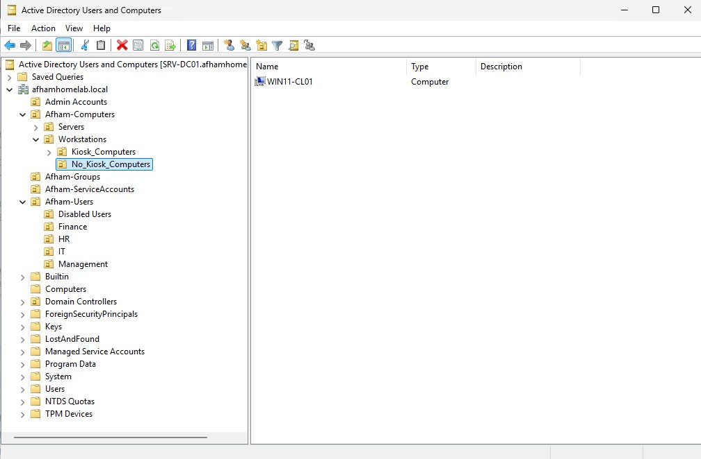

This provides practical experience with enterprise-style Active Directory organization and policy targeting.

---

# 🌐 8. DNS Server

DNS was installed alongside Active Directory Domain Services.

The Active Directory-integrated DNS zone is:

```text
afhamhomelab.local
```

DNS provides internal name resolution for domain-joined computers and infrastructure resources.

Important infrastructure records include:

```text
srv-dc01
WIN11-CL01
pve01
```

This allows systems to locate internal resources by hostname instead of relying exclusively on IP addresses.

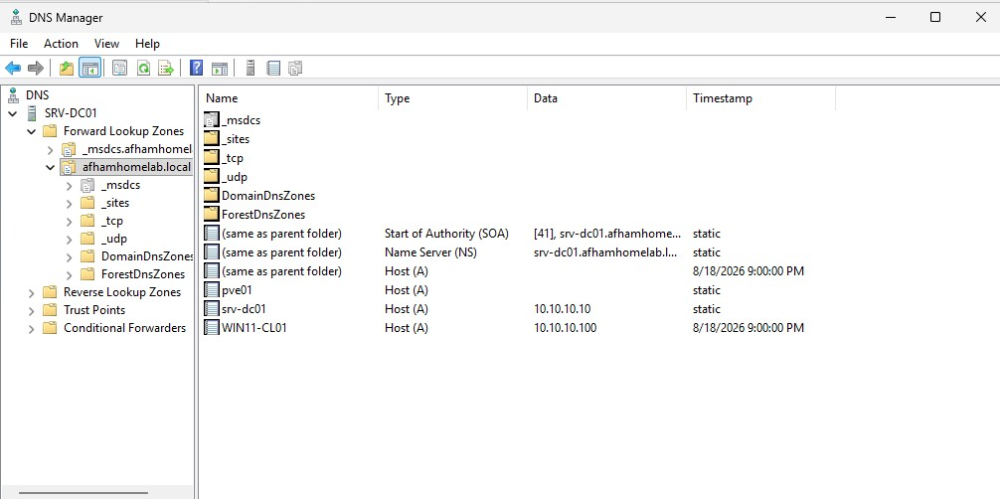

DNS integration is particularly important for Active Directory because domain clients depend on DNS to locate Domain Controllers and domain services.

pfSense DNS Resolver configuration is also integrated with the Windows DNS environment to provide name resolution between different areas of the HomeLab.

---

# 📡 9. DHCP Server

The Windows Server DHCP role was installed and configured.

A DHCP scope was created for the HomeLab network:

```text
Network:
10.10.10.0/24

DHCP Address Pool:
10.10.10.100
-
10.10.10.200
```

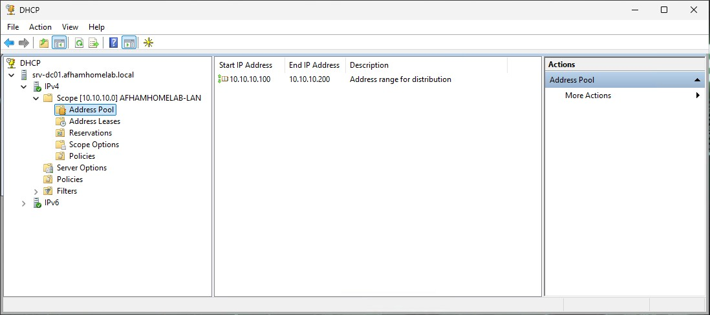

DHCP configuration provided practical experience with:

- DHCP installation
- DHCP authorization
- DHCP scopes
- Address pools
- IP address allocation
- Default gateway configuration
- DNS server assignment
- Scope activation/deactivation
- DHCP troubleshooting

DHCP responsibilities were also tested between Windows Server and pfSense.

Care was taken during testing to prevent conflicting DHCP services from simultaneously serving the same network.

---

# 🔐 10. Group Policy Management

Group Policy is used to centrally configure and enforce Windows security and workstation settings across the domain.

Multiple enterprise-style Group Policy Objects were created and tested.

Examples include:

```text
GPO-Workstation-Baseline

GPO-20-Microsoft-Defender

GPO-23-Windows-LAPS

GPO-24-Local-Admin-Provisioning

GPO-25-Windows-Firewall

GPO-26-Advanced-Audit-Policy

GPO-27-Windows-Event-Forwarding

GPO-User-Corporate-Wallpaper

MSFT-Windows11-25H2-Security-Baseline

MSFT-Windows11-25H2-BitLocker

MSFT-Windows11-25H2-Credential-Guard

MSFT-Windows11-25H2-Defender-Antivirus
```

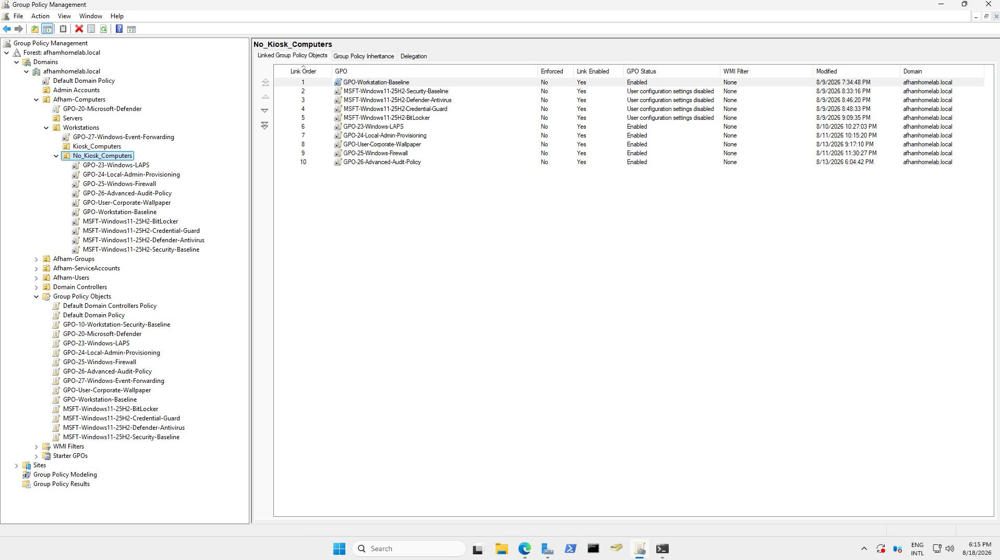

This allows security configurations to be centrally controlled instead of manually configuring individual workstations.

The implementation provided experience with:

- GPO creation
- GPO linking
- OU targeting
- Policy precedence
- Computer configuration
- User configuration
- Security baselines
- Policy troubleshooting
- `gpupdate`
- Group Policy Results

---

# 🔑 11. Windows LAPS

Windows Local Administrator Password Solution (LAPS) was configured within the Active Directory environment.

LAPS provides centralized management and automatic rotation of local administrator passwords on domain-joined Windows computers.

Configured LAPS policy areas include:

- Password backup directory
- Password settings
- Password encryption
- Authorized password decryptors
- Post-authentication actions
- Managed administrator account

A dedicated local administrator account named:

```text
IronMan
```

was provisioned for LAPS management within the lab.

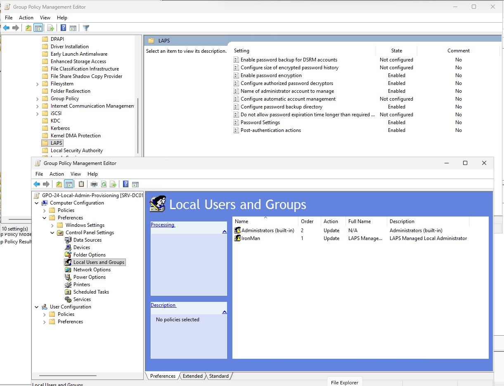

This demonstrates a more secure approach than deploying the same static local administrator password across multiple workstations.

The implementation also provided experience working with Windows LAPS Active Directory attributes and validating policy application.

---

# 🔒 12. BitLocker

BitLocker security policies were configured through Group Policy.

The Windows 11 domain workstation was used to test BitLocker configuration and drive encryption behaviour.

Policy areas included:

- Operating system drive encryption
- TPM integration
- Startup authentication
- Recovery configuration
- PIN-related configuration
- Encryption requirements

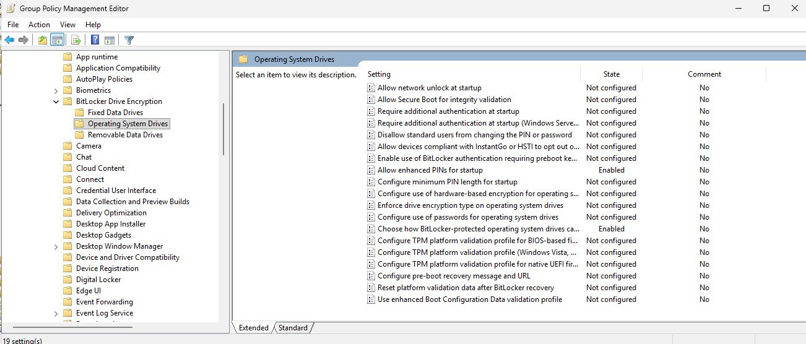

This provided practical experience with centrally managing endpoint disk encryption in a domain environment.

---

# 🛡️ 13. Microsoft Defender Antivirus

Microsoft Defender Antivirus was centrally managed using Group Policy.

The configuration included security controls for:

- Antivirus behaviour
- Potentially unwanted applications
- Remediation
- Security intelligence
- Local administrator visibility
- Real-time protection
- Endpoint protection settings

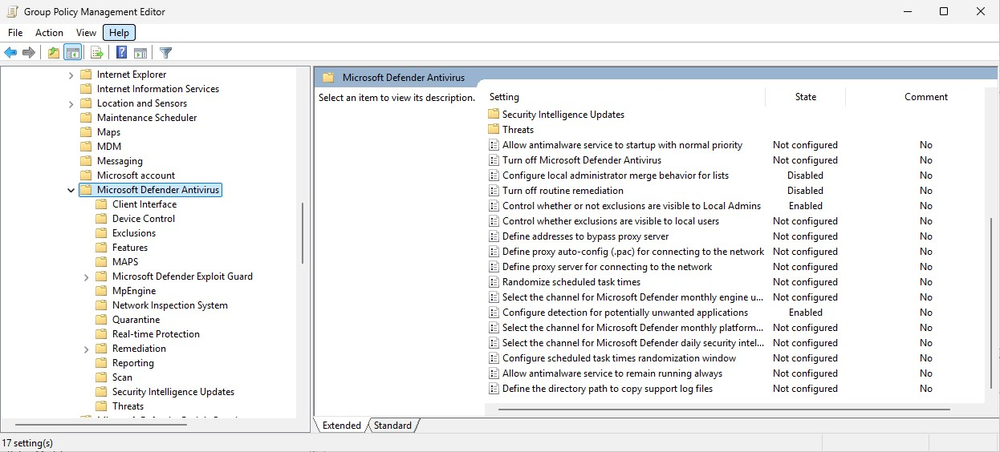

This demonstrates centralized endpoint security management using Active Directory Group Policy.

---

# 🔐 14. Credential Guard & Virtualization-Based Security

Virtualization-Based Security was configured through Group Policy.

The relevant policy is located under:

```text
Computer Configuration
    │
    └── Administrative Templates
          │
          └── System
                │
                └── Device Guard
```

The policy:

```text
Turn On Virtualization Based Security
```

was enabled.

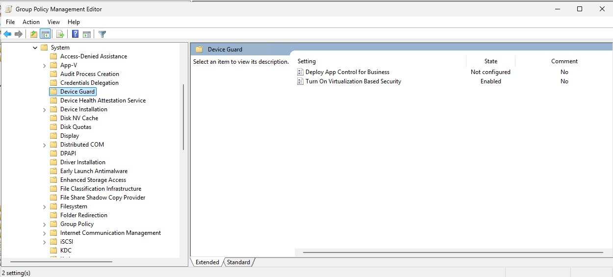

Credential Guard and VBS provide additional protection for Windows authentication credentials and security-sensitive processes.

This provided practical experience working with modern Windows endpoint security controls.

---

# 🔥 15. Windows Defender Firewall

Windows Defender Firewall was centrally configured through Group Policy.

Instead of disabling the firewall for administration, specific management traffic was allowed.

Examples of configured rules include:

```text
Allow ICMPv4 Ping from Management

Allow RDP from WireGuard

Windows Remote Management (HTTP-In)
```

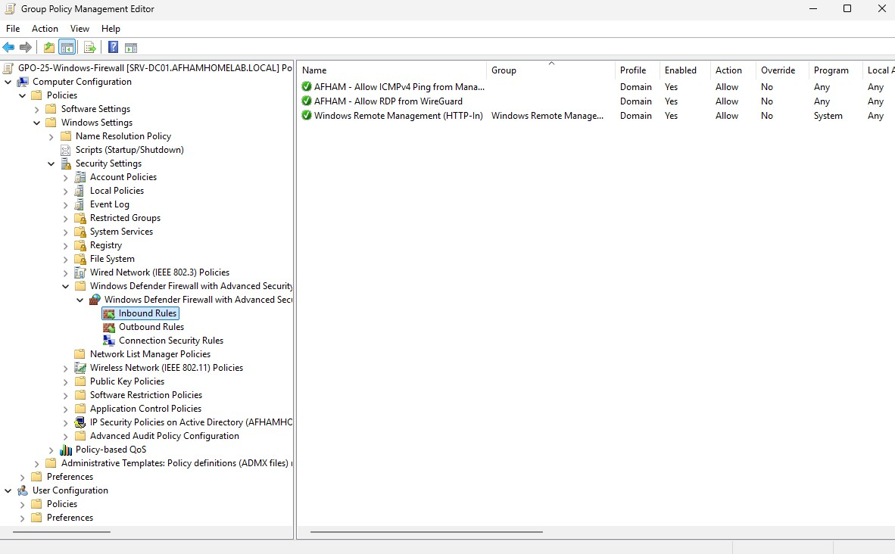

This follows the principle of allowing required administrative traffic while keeping host firewall protection enabled.

Remote administration can therefore be restricted to approved management paths.

---

# 📜 16. Advanced Audit Policy

Advanced Windows auditing was configured through Group Policy to increase security visibility.

Configured audit categories include:

```text
Account Management

Detailed Tracking

Logon / Logoff

Policy Change
```

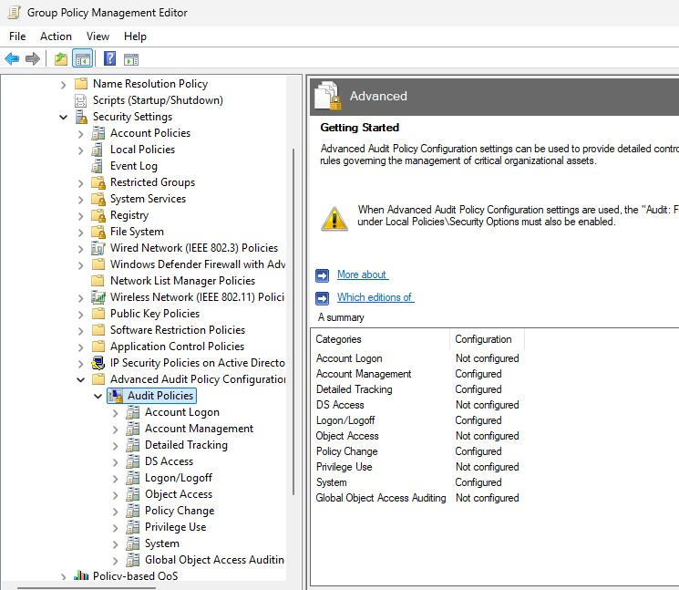

Process creation auditing was enabled to generate security events such as:

```text
Event ID 4688
A new process has been created
```

Authentication activity can also generate events such as:

```text
Event ID 4624
An account was successfully logged on
```

These events provide valuable information for troubleshooting, monitoring, incident investigation, and centralized event collection.

---

# 📊 17. Sysmon Monitoring

Microsoft Sysmon was deployed on the Windows 11 domain workstation to provide enhanced endpoint activity logging.

Sysmon was installed under:

```text
C:\Tools\Sysmon\
```

A Sysmon XML configuration was used to control event collection.

The Sysmon Operational log was successfully created and populated with events.

Sysmon provides visibility into activities including:

- Process creation
- Process termination
- File creation
- Registry modifications
- Network activity
- Security-relevant endpoint behaviour

The logs were verified under:

```text
Event Viewer
    │
    └── Applications and Services Logs
          │
          └── Microsoft
                │
                └── Windows
                      │
                      └── Sysmon
                            │
                            └── Operational
```

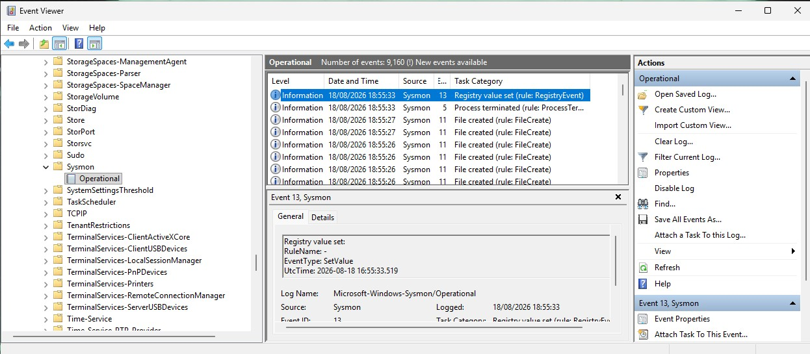

The screenshot demonstrates active Sysmon event generation on the Windows endpoint.

This provides significantly more endpoint telemetry than relying only on standard Windows logs.

---

# 📡 18. Windows Event Forwarding

Windows Event Forwarding (WEF) was implemented to centrally collect selected Windows events from domain-joined computers.

The architecture is:

```text
WIN11-CL01
     │
     ├── Windows Security Events
     │
     └── Sysmon
             │
             ▼
       Windows Event Log
             │
             ▼
 Windows Event Forwarding
             │
             ▼
         SRV-DC01
             │
             ▼
 Windows Event Collector
             │
             ▼
      Forwarded Events
```

A Windows Event Collector subscription was configured on SRV-DC01.

During initial implementation, the subscription experienced communication problems and forwarded events were not being received correctly.

The issue was investigated and the subscription/configuration was recreated and tested.

After troubleshooting, Windows events were successfully received by SRV-DC01.

The Forwarded Events log contained events from:

```text
WIN11-CL01
```

including:

```text
Event ID 4688
Process Creation
```

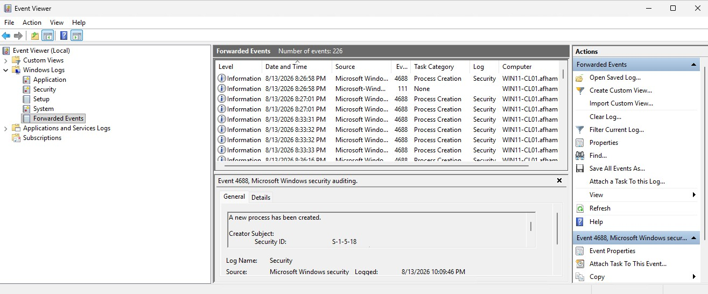

This demonstrates both centralized event collection and practical troubleshooting of Windows Event Forwarding.

---

# 📜 19. Active Directory Certificate Services

Active Directory Certificate Services was installed within the HomeLab to gain experience with enterprise Public Key Infrastructure.

The implementation provided exposure to:

- Certification Authority services
- Enterprise certificates
- Certificate trust
- Windows domain integration
- Certificate troubleshooting
- PKI concepts

During implementation, Certificate Authority communication and trust problems were encountered.

These issues were investigated and corrected as part of the lab.

This provided valuable troubleshooting experience beyond simply installing the AD CS role.

---

# ♻️ 20. Active Directory Recycle Bin

Active Directory Recycle Bin was enabled for the lab forest.

The Recycle Bin provides administrators with the ability to recover accidentally deleted Active Directory objects while preserving important object attributes.

The **Deleted Objects** container is available within Active Directory Administrative Center.

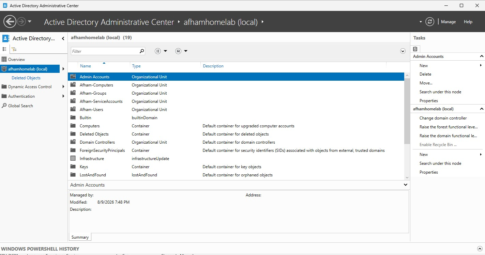

This provides an additional recovery mechanism for Active Directory administration and allows object recovery scenarios to be practiced without immediately relying on full server backup restoration.

---

# 💾 21. Windows Server Backup

A dedicated virtual disk was attached to SRV-DC01 for Windows Server backup and recovery testing.

The backup disk capacity is:

```text
50 GB
```

Windows Server Backup and the `wbadmin` command-line utility were used during backup testing.

The environment therefore contains separate:

```text
Primary OS Disk
80 GB

Backup Disk
50 GB
```

Keeping backup storage separate from the operating system disk allows backup and recovery procedures to be tested without using the primary system volume as the destination.

A manual Windows Server backup was successfully completed and verified.

Windows Server Backup reported:

```text
Status:
Successful

Total Backups:
1 copy
```

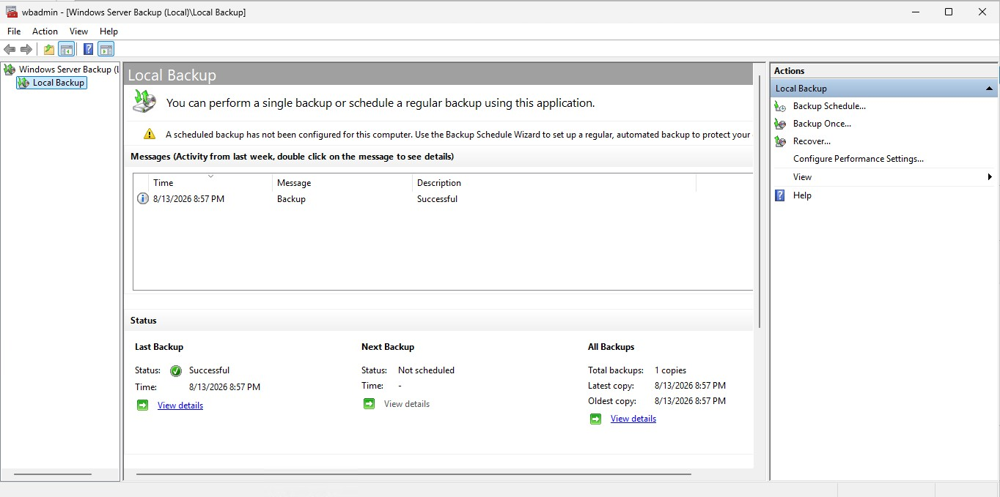

At the time of this documentation, the lab contains a **verified manual backup**.

An automated backup schedule is not currently configured.

The implementation provided experience with:

- Windows Server Backup
- `wbadmin`
- Dedicated backup storage
- Backup verification
- Recovery testing
- Restore procedures

---

# 🖥️ 22. Remote Administration

Remote Desktop was enabled on Windows Server to allow SRV-DC01 to be administered remotely from authorized management systems.

Remote administration is performed through the protected HomeLab environment.

External remote access can be established using the WireGuard VPN configured on pfSense.

The path is:

```text
Remote Device
      │
      ▼
WireGuard VPN
      │
      ▼
   pfSense
      │
      ▼
HomeLab Network
      │
      ▼
   SRV-DC01
```

This allows Windows Server administration without exposing Remote Desktop directly to the public Internet.

Firewall policies also restrict management access to approved traffic.

---

# 🔗 23. Integration with pfSense

Windows Server operates behind the pfSense firewall.

pfSense provides:

- Network routing
- Firewall protection
- NAT
- WireGuard VPN
- Dynamic DNS
- DNS Resolver
- DNS forwarding/overrides
- Remote-access connectivity

Windows Server provides:

- Active Directory
- DNS
- DHCP
- Group Policy
- Identity management
- Certificate Services
- Windows security policies
- Windows Event Collection
- Backup and recovery

Together, these systems create an integrated enterprise-style infrastructure environment.

---

# 🔗 24. Integration with Windows 11

A Windows 11 virtual machine was deployed within Proxmox and joined to the Active Directory domain.

The workstation is:

```text
WIN11-CL01
```

The client is used to test:

- Domain authentication
- Active Directory computer management
- DNS
- Group Policy
- Windows LAPS
- BitLocker
- Microsoft Defender
- Credential Guard
- Windows Firewall
- Advanced auditing
- Sysmon
- Windows Event Forwarding
- Remote administration
- Enterprise security policies

This provides a realistic client/server environment for testing centralized Windows administration.

---

# 🧪 25. Testing & Validation

The Windows Server environment was tested throughout implementation.

Testing included:

- Server network connectivity
- DNS resolution
- Domain authentication
- Windows 11 domain joining
- Active Directory OU placement
- Group Policy processing
- Remote Desktop connectivity
- Windows LAPS functionality
- BitLocker policy application
- Microsoft Defender policies
- Credential Guard / VBS
- Windows Firewall policies
- Advanced Audit Policy
- Sysmon logging
- Windows Event Forwarding
- Certificate Services
- DHCP configuration
- Windows Server Backup
- Recovery procedures
- Active Directory object recovery

Testing was performed after major configuration changes to verify that services were operating correctly.

---

# 🔧 26. Troubleshooting Experience

Several realistic troubleshooting scenarios were encountered while building the Windows Server environment.

These included:

- Domain connectivity problems
- DNS resolution issues
- Certificate Authority communication errors
- Certificate trust problems
- Group Policy troubleshooting
- Windows Event Forwarding communication failures
- Sysmon installation verification
- Missing Sysmon service/logging
- Remote Desktop connectivity issues
- DHCP configuration conflicts
- LAPS configuration validation
- Backup and recovery testing
- Windows service startup/dependency issues

One particularly useful troubleshooting exercise involved Windows Event Forwarding.

The initial WEF subscription produced communication errors and did not correctly populate the Forwarded Events log.

The configuration was investigated, recreated and retested until events from WIN11-CL01 successfully appeared on SRV-DC01.

Sysmon also required verification and installation before the Sysmon Operational log became available.

Troubleshooting these issues provided practical experience beyond simply installing Windows Server roles.

---

# 🛡️ 27. Security Architecture

The Windows environment now uses multiple layers of security.

```text
                     Internet
                        │
                        ▼
                     pfSense
                        │
             Firewall / WireGuard
                        │
                        ▼
                  Internal LAN
                        │
             ┌──────────┴──────────┐
             │                     │
             ▼                     ▼
         SRV-DC01              WIN11-CL01
             │                     │
             │                     ├── BitLocker
             │                     ├── Defender
             │                     ├── Credential Guard
             │                     ├── Windows Firewall
             │                     ├── LAPS
             │                     ├── Audit Policies
             │                     └── Sysmon
             │
             ├── Active Directory
             ├── DNS
             ├── DHCP
             ├── Group Policy
             ├── Certificate Services
             ├── Windows Event Collector
             ├── AD Recycle Bin
             └── Windows Server Backup
```

This design combines network security, identity security, endpoint protection, centralized management, monitoring, and recovery.

---

# 📸 28. Configuration Evidence

The repository contains screenshots documenting the major Windows Server technologies implemented during this stage.

## Server Infrastructure

- Windows Server Manager Dashboard
- Local Server configuration
- Installed infrastructure roles

## Active Directory

- Active Directory OU structure
- Domain-joined Windows 11 workstation
- Active Directory Recycle Bin

## Network Services

- Windows DNS zone
- DHCP address pool

## Group Policy & Endpoint Security

- Group Policy Management
- Windows LAPS
- Local administrator provisioning
- BitLocker policy
- Microsoft Defender Antivirus policy
- Credential Guard / VBS
- Windows Defender Firewall
- Advanced Audit Policy

## Monitoring

- Sysmon Operational events
- Windows Event Forwarding
- Forwarded security events

## Backup & Recovery

- Successful Windows Server Backup
- Active Directory Recycle Bin

> **Security Notice:** Public screenshots are sanitized where appropriate. Passwords, private keys, recovery keys, authentication information, certificates, public-facing addressing information, and other sensitive infrastructure information should not be exposed in this repository.

---

# 🧠 29. Skills Demonstrated

This stage demonstrates practical experience with:

### Windows Server Administration

- Windows Server 2025
- Server Manager
- Windows Server roles and features
- Remote administration
- Windows service troubleshooting

### Virtualization

- Proxmox VE
- KVM/QEMU
- VirtIO
- Virtual disk management
- Virtual networking

### Identity & Access Management

- Active Directory Domain Services
- Domain Controller deployment
- Organizational Units
- Domain users
- Domain computers
- Security groups
- Administrative accounts
- Windows LAPS

### Network Services

- DNS
- DHCP
- Static addressing
- Internal name resolution
- pfSense integration

### Group Policy

- GPO creation
- GPO linking
- OU targeting
- Microsoft security baselines
- Endpoint policy management
- Group Policy troubleshooting

### Endpoint Security

- Microsoft Defender Antivirus
- Windows Defender Firewall
- BitLocker
- Credential Guard
- Virtualization-Based Security
- Local administrator management

### Security Monitoring

- Advanced Audit Policy
- Windows Event Viewer
- Windows Event Forwarding
- Windows Event Collector
- Sysmon
- Event ID analysis
- Centralized logging

### PKI

- Active Directory Certificate Services
- Certificate Authority
- Certificate trust
- PKI troubleshooting

### Backup & Recovery

- Windows Server Backup
- `wbadmin`
- Dedicated backup storage
- Backup verification
- Restore testing
- Active Directory Recycle Bin

### Troubleshooting

- DNS troubleshooting
- DHCP troubleshooting
- Domain connectivity
- Group Policy
- WEF
- Sysmon
- Certificate Services
- Remote administration
- Backup and recovery

---

# 📊 30. Current Environment Status

| Component | Status |
|---|---|
| Windows Server 2025 | ✅ Operational |
| SRV-DC01 | ✅ Operational |
| Domain Controller | ✅ Operational |
| Active Directory | ✅ Operational |
| Windows 11 Domain Client | ✅ Joined |
| DNS Server | ✅ Operational |
| DHCP Server | ✅ Configured |
| Group Policy | ✅ Operational |
| Windows LAPS | ✅ Configured |
| Local Admin Provisioning | ✅ Configured |
| BitLocker Policy | ✅ Configured |
| Microsoft Defender Policy | ✅ Configured |
| Credential Guard / VBS | ✅ Configured |
| Windows Defender Firewall GPO | ✅ Configured |
| Advanced Audit Policy | ✅ Configured |
| Sysmon | ✅ Operational |
| Windows Event Forwarding | ✅ Verified |
| Windows Event Collector | ✅ Receiving Events |
| Active Directory Certificate Services | ✅ Configured |
| Active Directory Recycle Bin | ✅ Enabled |
| Windows Server Backup | ✅ Manual Backup Verified |
| Automated Server Backup | ⏳ Not Configured |

---

# 🎯 31. Key Learning Outcomes

Through this stage of the Enterprise HomeLab, I gained practical experience deploying and administering a Windows Server environment rather than only studying Windows Server technologies theoretically.

The environment provided hands-on experience integrating:

```text
Virtualization
      │
      ▼
Networking
      │
      ▼
Active Directory
      │
      ▼
DNS / DHCP
      │
      ▼
Group Policy
      │
      ▼
Endpoint Security
      │
      ▼
Monitoring
      │
      ▼
Backup & Recovery
```

The project also provided practical troubleshooting experience with real configuration problems.

Instead of simply following installation procedures, problems were diagnosed, configurations were corrected, and functionality was verified.

Important learning areas included:

- Designing Active Directory structure
- Managing Windows clients centrally
- Implementing security baselines
- Protecting local administrator credentials
- Managing endpoint firewall policies
- Configuring disk encryption policies
- Implementing centralized Windows auditing
- Deploying Sysmon
- Collecting events centrally with WEF
- Managing internal DNS
- Configuring DHCP
- Implementing server backup
- Recovering Active Directory objects
- Troubleshooting interconnected infrastructure services

---

# 🏆 32. Stage Outcome

The Windows Server 2025 environment has progressed from a basic server installation into an integrated enterprise-style Windows infrastructure lab.

The completed environment provides:

**Identity**

Active Directory Domain Services provides centralized authentication and identity management.

**Networking**

DNS and DHCP provide core Windows network services.

**Management**

Group Policy provides centralized configuration of domain computers.

**Endpoint Security**

Windows LAPS, BitLocker, Microsoft Defender, Credential Guard and Windows Firewall provide layered endpoint protection.

**Auditing & Monitoring**

Advanced Audit Policy, Sysmon, Windows Event Forwarding and Windows Event Collector provide centralized security visibility.

**Recovery**

Active Directory Recycle Bin and Windows Server Backup provide recovery capabilities.

**Remote Administration**

pfSense and WireGuard provide protected remote connectivity to the environment.

The result is a HomeLab that demonstrates practical experience across multiple technologies commonly encountered in Windows System Administrator and Infrastructure Administrator roles.

---

# ➡️ 33. Next Stage

The next stage of the Enterprise HomeLab will document Active Directory in greater depth.

Planned topics include:

- Domain architecture
- Domain Controller configuration
- Organizational Unit design
- User management
- Group management
- Computer management
- Administrative accounts
- Service accounts
- Delegation
- Active Directory security
- Active Directory Recycle Bin
- Testing
- Troubleshooting

The goal is to continue expanding the repository into a structured technical portfolio demonstrating practical enterprise infrastructure administration.
