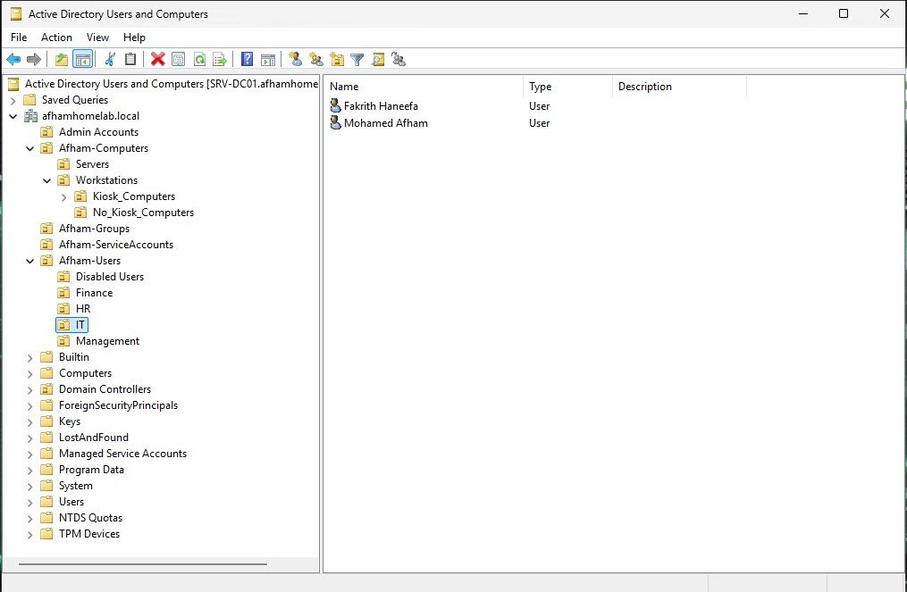
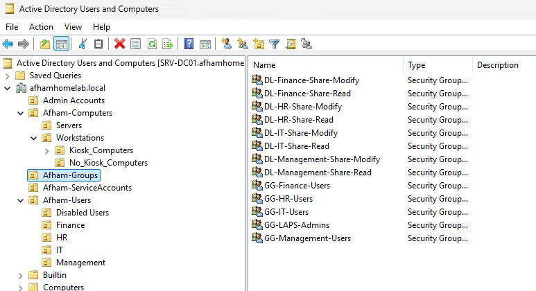
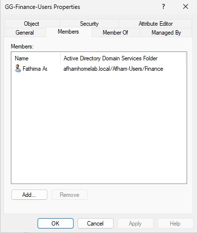
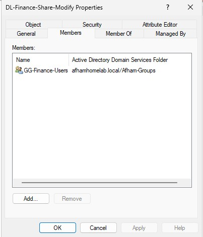
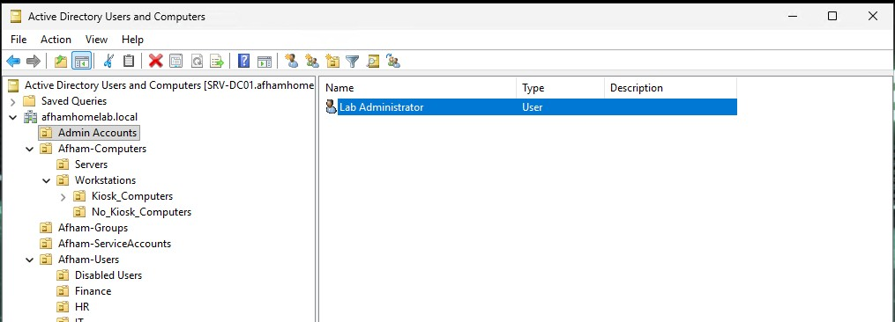
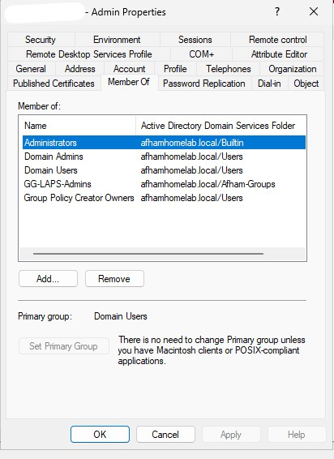
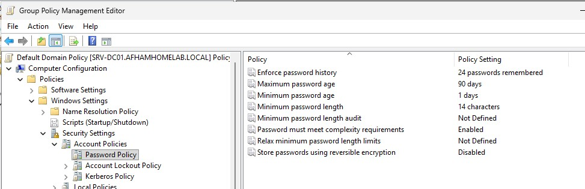
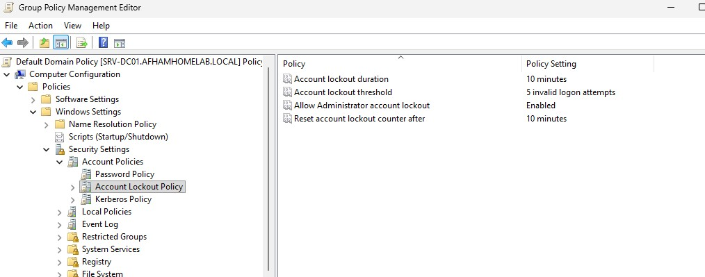
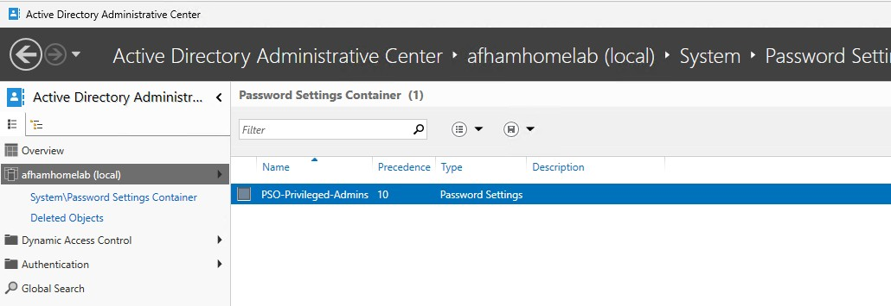

# 🏢 Active Directory Domain Services

Enterprise-style Microsoft Active Directory Domain Services implementation built as part of my **Enterprise HomeLab**.

This section documents the design, configuration, security, administration, and validation of the Active Directory environment.

The lab demonstrates practical experience with:

- Active Directory Domain Services
- Organizational Unit design
- User and computer management
- Security group design
- AGDLP permission architecture
- Privileged administrative accounts
- Domain password policies
- Account lockout policies
- Fine-Grained Password Policies
- Delegation of Control
- Active Directory Sites and Services
- FSMO roles
- Domain Controller health validation
- Active Directory DNS validation
- Active Directory Recycle Bin
- Group Managed Service Accounts (gMSA)
- KDS Root Key
- PowerShell-based Active Directory administration

---

# 📌 Environment Overview

| Component | Configuration |
|---|---|
| Active Directory Domain | `afhamhomelab.local` |
| Domain Controller | `SRV-DC01` |
| Domain Controller IP | `10.10.10.10` |
| Active Directory Site | `Malta-HQ` |
| AD Subnet | `10.10.10.0/24` |
| Domain Client | `WIN11-CL01` |
| Client IP | `10.10.10.100` |
| Directory Service | Active Directory Domain Services |
| DNS | Active Directory-integrated DNS |
| Authentication | Kerberos / NTLM |
| Server Platform | Windows Server 2025 |

---

# 🏗️ Active Directory Architecture

The Active Directory environment was designed using dedicated Organizational Units for users, computers, groups, administrative accounts, and service accounts.

```text
afhamhomelab.local
│
├── Admin Accounts
│
├── Afham-Computers
│   ├── Servers
│   └── Workstations
│       ├── Kiosk_Computers
│       └── No_Kiosk_Computers
│
├── Afham-Groups
│
├── Afham-ServiceAccounts
│
├── Afham-Users
│   ├── Disabled Users
│   ├── Finance
│   ├── HR
│   ├── IT
│   └── Management
│
└── Domain Controllers
    └── SRV-DC01
```

This structure provides logical separation between different Active Directory object types and allows permissions, Group Policy, and delegated administration to be managed more effectively.

---

# 👥 Organizational Unit Design

Custom Organizational Units were created instead of placing all accounts and computers inside the default Active Directory containers.

Main Organizational Units:

```text
Admin Accounts
Afham-Computers
Afham-Groups
Afham-ServiceAccounts
Afham-Users
```

Departmental user structure:

```text
Afham-Users
│
├── Disabled Users
├── Finance
├── HR
├── IT
└── Management
```

Computer structure:

```text
Afham-Computers
│
├── Servers
│
└── Workstations
    ├── Kiosk_Computers
    └── No_Kiosk_Computers
```

This design provides a scalable foundation for:

- User administration
- Computer administration
- Group Policy targeting
- Security delegation
- Department-based access control
- Future infrastructure expansion

### 📸 Active Directory User & OU Structure



---

# 🖥️ Domain-Joined Workstation

A Windows 11 workstation was joined to the Active Directory domain.

```text
Computer Name:
WIN11-CL01

Domain:
afhamhomelab.local

IP Address:
10.10.10.100
```

The workstation receives centralized services from the domain including:

- Domain authentication
- Active Directory DNS
- Group Policy
- Security policies
- LAPS
- Administrative controls
- Event monitoring configuration

The workstation is stored within the custom workstation OU structure.

```text
Afham-Computers
└── Workstations
```

---

# 👤 Active Directory User Management

User accounts were created inside department-specific Organizational Units.

Example structure:

```text
Afham-Users
│
├── Finance
├── HR
├── IT
└── Management
```

This allows accounts to be organized according to their business function rather than placing every account inside the default `Users` container.

Administrative exercises included:

- Creating domain users
- Moving users between OUs
- Disabling user accounts
- Unlocking accounts
- Resetting passwords
- Configuring account expiration
- Managing password options
- Managing group membership
- Separating standard and privileged accounts

### 📸 User Structure


---

# 👥 Active Directory Security Groups

Security groups were created to implement role-based access control.

Examples include:

```text
GG-Finance-Users
GG-HR-Users
GG-IT-Users
GG-Management-Users

DL-Finance-Share-Read
DL-Finance-Share-Modify

DL-HR-Share-Read
DL-HR-Share-Modify

DL-IT-Share-Read
DL-IT-Share-Modify

DL-Management-Share-Read
DL-Management-Share-Modify

GG-LAPS-Admins
GG-Helpdesk-PasswordReset
GG-Privileged-Admins
GG-gMSA-Hosts
```

The naming convention helps identify both the scope and purpose of each group.

### Naming Convention

```text
GG = Global Group
DL = Domain Local Group
```

Examples:

```text
GG-Finance-Users
```

represents Finance department user accounts.

```text
DL-Finance-Share-Modify
```

represents a Domain Local group intended to receive Modify permissions on a Finance resource.

### 📸 Security Group Structure



---

# 🌍 Global Group Membership

Department users were placed into their corresponding Global Security Groups.

Example:

```text
Finance User
      │
      ▼
GG-Finance-Users
```

This allows access to be assigned based on job role or department instead of directly assigning resource permissions to individual accounts.

### 📸 Global Group Membership



---

# 🔗 AGDLP Permission Model

The lab implements Microsoft's **AGDLP** permission model.

```text
A → G → DL → P

Accounts
   ↓
Global Groups
   ↓
Domain Local Groups
   ↓
Permissions
```

Example Finance permission structure:

```text
Finance User
      │
      ▼
GG-Finance-Users
      │
      ▼
DL-Finance-Share-Modify
      │
      ▼
Finance Resource
```

Instead of assigning permissions directly to users:

1. User accounts are placed into Global Groups.
2. Global Groups represent departments or business roles.
3. Global Groups are nested inside Domain Local Groups.
4. Domain Local Groups receive permissions to resources.

For example:

```text
User
 ↓
GG-Finance-Users
 ↓
DL-Finance-Share-Modify
 ↓
Modify Permission
```

This approach improves:

- Scalability
- Permission management
- Auditing
- Troubleshooting
- Role-based access control
- User onboarding and offboarding

### 📸 AGDLP Group Nesting



---

# 🔐 Privileged Administrative Accounts

Privileged administration was separated from normal user accounts.

A dedicated Organizational Unit was created:

```text
Admin Accounts
```

A separate administrative identity is used for elevated Active Directory administration.

This provides separation between:

```text
Standard User Account
        │
        └── Everyday activity

Privileged Admin Account
        │
        └── Administrative activity
```

The goal is to avoid using highly privileged accounts for normal day-to-day activities.

### 📸 Dedicated Administrative Account



---

# 👑 Administrative Group Membership

The privileged administrative account's group membership was reviewed and unnecessary elevated memberships were removed.

The account retains the administrative groups required for the lab environment while avoiding unnecessary group memberships.

This exercise demonstrates the importance of reviewing privileged group membership rather than simply assigning every administrative role available.

Important privileged groups can include:

```text
Administrators
Domain Admins
Enterprise Admins
Schema Admins
Group Policy Creator Owners
```

Membership should always be limited according to administrative requirements.

### 📸 Administrative Group Membership



---

# 🔑 Domain Password Policy

A domain password policy was configured through Group Policy.

Configuration:

| Setting | Value |
|---|---:|
| Enforce password history | 24 passwords |
| Maximum password age | 90 days |
| Minimum password age | 1 day |
| Minimum password length | 7 characters |
| Password complexity | Enabled |
| Store passwords using reversible encryption | Disabled |

Policy location:

```text
Computer Configuration
└── Policies
    └── Windows Settings
        └── Security Settings
            └── Account Policies
                └── Password Policy
```

The policy establishes the default password requirements for domain accounts.

### 📸 Domain Password Policy



---

# 🔒 Account Lockout Policy

An account lockout policy was configured to help protect domain accounts against repeated password-guessing attempts.

Configuration:

| Setting | Value |
|---|---:|
| Account lockout threshold | 5 invalid logon attempts |
| Account lockout duration | 10 minutes |
| Reset account lockout counter after | 10 minutes |
| Allow Administrator account lockout | Enabled |

Policy location:

```text
Computer Configuration
└── Policies
    └── Windows Settings
        └── Security Settings
            └── Account Policies
                └── Account Lockout Policy
```

The policy helps reduce the effectiveness of repeated authentication attempts against domain accounts.

### 📸 Account Lockout Policy



---

# 🛡️ Fine-Grained Password Policy

A **Fine-Grained Password Policy (FGPP)** was implemented using a Password Settings Object (PSO).

The purpose is to apply stronger password requirements to privileged administrative accounts without changing the password requirements for every user in the domain.

The Password Settings Object created was:

```text
PSO-Privileged-Admins
```

The policy applies to:

```text
GG-Privileged-Admins
```

Configuration:

| Setting | Value |
|---|---:|
| Precedence | 10 |
| Minimum password length | 16 characters |
| Password history | 24 passwords |
| Password complexity | Enabled |
| Minimum password age | 1 day |
| Maximum password age | 90 days |
| Failed attempts before lockout | 5 |
| Reset failed attempts counter | 15 minutes |
| Lockout duration | 15 minutes |
| Reversible encryption | Disabled |
| Protect from accidental deletion | Enabled |

Architecture:

```text
Privileged Admin
      │
      ▼
GG-Privileged-Admins
      │
      ▼
PSO-Privileged-Admins
      │
      ▼
Stronger Password Policy
```

This demonstrates how different password requirements can be applied to selected users or security groups within the same Active Directory domain.

### 📸 Fine-Grained Password Policy



---

# 🧑‍💻 Helpdesk Delegation of Control

A dedicated security group was created for Helpdesk password administration:

```text
GG-Helpdesk-PasswordReset
```

The appropriate Helpdesk user was added to this security group.

The group was then delegated permission over the required user Organizational Unit through the **Delegation of Control Wizard**.

The delegated task was:

```text
Reset user passwords and force password change at next logon
```

Permission model:

```text
Helpdesk User
      │
      ▼
GG-Helpdesk-PasswordReset
      │
      ▼
Afham-Users
      │
      ├── Reset User Password
      │        └── Allowed
      │
      └── Other Administrative Tasks
               └── Not automatically granted
```

This demonstrates the principle of **least privilege**.

Helpdesk personnel can perform their required password-management task without being granted Domain Admin privileges.

---

# 🗺️ Active Directory Sites and Services

Active Directory Sites and Services was configured to represent the physical/network topology of the HomeLab.

The default Active Directory site:

```text
Default-First-Site-Name
```

was renamed to:

```text
Malta-HQ
```

The Domain Controller is associated with:

```text
Sites
│
└── Malta-HQ
    │
    └── Servers
        │
        └── SRV-DC01
            │
            └── NTDS Settings
```

This creates a clearer enterprise-style site structure and prepares the environment for future multi-site or multi-Domain Controller deployments.

---

# 🌐 Active Directory Subnet

The following network was registered as an Active Directory subnet:

```text
10.10.10.0/24
```

The subnet was associated with:

```text
Malta-HQ
```

Topology:

```text
10.10.10.0/24
      │
      ▼
Malta-HQ
      │
      ▼
SRV-DC01
```

Associating network subnets with Active Directory sites allows domain clients to determine their correct site and locate appropriate Active Directory services.

---

# 🔍 Active Directory Site Discovery Validation

Site discovery was tested from the domain-joined Windows 11 workstation.

Command:

```powershell
nltest /dsgetsite
```

Result:

```text
Malta-HQ
The command completed successfully
```

Domain Controller discovery was also tested.

```powershell
nltest /dsgetdc:afhamhomelab.local
```

After refreshing DNS/DC locator information:

```powershell
ipconfig /flushdns

nltest /dsgetdc:afhamhomelab.local /force
```

The workstation successfully discovered:

```text
DC:            \\SRV-DC01.afhamhomelab.local
Address:       \\10.10.10.10
DC Site Name:  Malta-HQ
Our Site Name: Malta-HQ
```

This confirmed the complete mapping:

```text
WIN11-CL01
10.10.10.100
      │
      ▼
10.10.10.0/24
      │
      ▼
Malta-HQ
      │
      ▼
SRV-DC01
```

---

# 👑 FSMO Roles

Flexible Single Master Operations roles were verified using:

```powershell
netdom query fsmo
```

All five FSMO roles are currently hosted by:

```text
SRV-DC01.afhamhomelab.local
```

Current role ownership:

| FSMO Role | Current Holder |
|---|---|
| Schema Master | `SRV-DC01` |
| Domain Naming Master | `SRV-DC01` |
| PDC Emulator | `SRV-DC01` |
| RID Pool Manager | `SRV-DC01` |
| Infrastructure Master | `SRV-DC01` |

This is expected because the current environment contains a single Domain Controller.

The five FSMO roles provide specialized Active Directory functionality.

```text
Forest-Wide Roles
│
├── Schema Master
└── Domain Naming Master

Domain-Wide Roles
│
├── PDC Emulator
├── RID Master
└── Infrastructure Master
```

A future second Domain Controller deployment will allow FSMO role transfer and redundancy exercises.

---

# 🩺 Active Directory Health Validation

Domain Controller health was validated using:

```powershell
dcdiag
```

`SRV-DC01` successfully passed the core diagnostic tests observed during validation, including:

```text
Connectivity
Advertising
FrsEvent
DFSREvent
SysVolCheck
KccEvent
KnowsOfRoleHolders
MachineAccount
NCSecDesc
NetLogons
ObjectsReplicated
Replications
RidManager
Services
SystemLog
VerifyReferences
```

The diagnostic output also correctly identified the Domain Controller under:

```text
Malta-HQ\SRV-DC01
```

This confirmed that the Domain Controller was operational and that the Active Directory site configuration was recognized correctly.

---

# 🌐 Active Directory DNS Health

Detailed Active Directory DNS diagnostics were performed using:

```powershell
dcdiag /test:dns /v
```

The DNS diagnostics validated the main DNS components required by Active Directory.

Tests included:

```text
Authentication
Basic DNS connectivity
Forwarding / Root Hints
Delegation
Dynamic Updates
Record Registration
```

The environment also successfully registered Active Directory site-specific DNS records for:

```text
Malta-HQ
```

These records are important for locating services such as:

```text
LDAP
Kerberos
Domain Controllers
Global Catalog
```

This confirmed that Active Directory-integrated DNS was operating correctly.

---

# ♻️ Active Directory Recycle Bin

Active Directory Recycle Bin was enabled to improve recovery capability for accidentally deleted directory objects.

Recoverable objects can include:

- Users
- Groups
- Computers
- Organizational Units

The feature is managed through:

```text
Active Directory Administrative Center
```

Deleted objects are accessible through:

```text
afhamhomelab (local)
└── Deleted Objects
```

This provides an additional recovery mechanism for Active Directory objects.

Detailed Windows Server configuration and the Recycle Bin screenshot are documented in:

```text
03-windows-server-2025/
```

---

# 🔧 Group Managed Service Accounts (gMSA)

A **Group Managed Service Account (gMSA)** was implemented to demonstrate secure service identity management.

Traditional service accounts can require administrators to manually create, store, protect, and rotate passwords.

A gMSA allows Active Directory to automatically manage the service account password.

Architecture:

```text
Active Directory
      │
      ▼
KDS Root Key
      │
      ▼
gMSA-LabService$
      │
      ▼
Authorized Computers
```

---

# 🔑 KDS Root Key

The Key Distribution Service Root Key was verified using:

```powershell
Get-KdsRootKey
```

The existing KDS Root Key was confirmed as valid.

The output included:

```text
IsFormatValid : True
```

and identified the Domain Controller responsible for the configuration.

The KDS Root Key provides the cryptographic foundation Active Directory uses to generate managed passwords for gMSAs.

---

# 👥 gMSA Host Security Group

A dedicated security group was used to control which computers can retrieve the managed service account password.

Group:

```text
GG-gMSA-Hosts
```

The following computer account was authorized:

```text
WIN11-CL01$
```

Architecture:

```text
GG-gMSA-Hosts
      │
      ▼
WIN11-CL01$
```

Using a security group makes the authorization model easier to manage as additional servers or workstations are added to the lab.

---

# ⚙️ gMSA Creation

The Group Managed Service Account created for the lab is:

```text
gMSA-LabService$
```

Configuration:

```text
Name:
gMSA-LabService

DNS Hostname:
gMSA-LabService.afhamhomelab.local

Authorized Host Group:
GG-gMSA-Hosts
```

The account was created using PowerShell:

```powershell
New-ADServiceAccount `
    -Name "gMSA-LabService" `
    -DNSHostName "gMSA-LabService.afhamhomelab.local" `
    -PrincipalsAllowedToRetrieveManagedPassword "GG-gMSA-Hosts"
```

The configuration was verified using:

```powershell
Get-ADServiceAccount "gMSA-LabService" -Properties * |
Select-Object Name,Enabled,DNSHostName,SamAccountName,PrincipalsAllowedToRetrieveManagedPassword
```

The account was confirmed as:

```text
Name           : gMSA-LabService
Enabled        : True
DNSHostName    : gMSA-LabService.afhamhomelab.local
SamAccountName : gMSA-LabService$
```

Password retrieval is restricted to:

```text
GG-gMSA-Hosts
```

---

# 🧪 gMSA Client Validation

The computer account:

```text
WIN11-CL01$
```

was added to:

```text
GG-gMSA-Hosts
```

The workstation was restarted so that its computer security token reflected the new group membership.

The Active Directory PowerShell cmdlet was first verified:

```powershell
Get-Command Test-ADServiceAccount
```

The workstation then tested access to the managed service account:

```powershell
Test-ADServiceAccount -Identity "gMSA-LabService"
```

Result:

```text
True
```

This confirmed that `WIN11-CL01` is successfully authorized to retrieve the managed password for:

```text
gMSA-LabService$
```

Complete flow:

```text
KDS Root Key
      │
      ▼
Active Directory
      │
      ▼
gMSA-LabService$
      │
      ▼
GG-gMSA-Hosts
      │
      ▼
WIN11-CL01$
      │
      ▼
Test-ADServiceAccount
      │
      ▼
TRUE
```

---

# 🔐 gMSA Security Benefits

The gMSA implementation demonstrates:

- Automatic service-account password management
- Automatic password rotation
- No manually maintained service password
- Computer-based authorization
- Restricted managed-password retrieval
- Centralized service identity management
- Reduced credential exposure
- Integration with Active Directory
- Integration with KDS

---

# 🛡️ Active Directory Security Model

The Active Directory implementation follows several important enterprise administration principles.

## Least Privilege

Users and administrators should receive only the permissions required to perform their assigned tasks.

---

## Role-Based Access Control

Permissions are assigned through security groups rather than directly to individual users.

```text
User
 ↓
Role Group
 ↓
Permission Group
 ↓
Resource
```

---

## AGDLP

Resource access follows:

```text
Accounts
   ↓
Global Groups
   ↓
Domain Local Groups
   ↓
Permissions
```

---

## Administrative Separation

Standard user identities are separated from privileged administrative identities.

---

## Delegated Administration

Helpdesk users can perform specific administrative tasks without receiving Domain Admin privileges.

---

## Privileged Password Protection

Fine-Grained Password Policies provide stronger password controls for selected privileged identities.

---

## Managed Service Identities

gMSAs reduce reliance on manually maintained service-account passwords.

---

## Organizational Separation

Users, computers, groups, administrative identities, and service identities are stored in dedicated Organizational Units.

---

# 🧩 Current Active Directory Logical Design

```text
                        afhamhomelab.local
                                 │
        ┌────────────────────────┼────────────────────────┐
        │                        │                        │
    SRV-DC01                Afham-Users              Afham-Groups
        │                        │                        │
    AD DS + DNS          Department OUs           Security Groups
        │                        │                        │
        │              ┌─────────┼─────────┐              │
        │              │         │         │              │
        │           Finance      HR       IT        Management
        │
        ├──────────────── Malta-HQ
        │                     │
        │                10.10.10.0/24
        │
        │
        └──────────────────────────── WIN11-CL01
                                         │
                                         ▼
                                  Domain Authentication
                                         │
                        ┌────────────────┼────────────────┐
                        │                │                │
                      GPO              LAPS              WEF
```

---

# 🧪 Active Directory Administration Commands

The following commands were used during implementation and troubleshooting.

## Domain Controller Health

```powershell
dcdiag
```

---

## Active Directory DNS Diagnostics

```powershell
dcdiag /test:dns /v
```

---

## FSMO Role Discovery

```powershell
netdom query fsmo
```

---

## Active Directory Site Discovery

```powershell
nltest /dsgetsite
```

---

## Domain Controller Discovery

```powershell
nltest /dsgetdc:afhamhomelab.local
```

---

## Force Domain Controller Discovery

```powershell
nltest /dsgetdc:afhamhomelab.local /force
```

---

## Flush DNS Resolver Cache

```powershell
ipconfig /flushdns
```

---

## KDS Root Key Verification

```powershell
Get-KdsRootKey
```

---

## gMSA Configuration Verification

```powershell
Get-ADServiceAccount "gMSA-LabService" -Properties *
```

---

## gMSA Authorization Test

```powershell
Test-ADServiceAccount -Identity "gMSA-LabService"
```

Expected result:

```text
True
```

---

# 📸 Active Directory Screenshots

The following screenshots document the major Active Directory configurations implemented in this lab.

| Configuration | Screenshot |
|---|---|
| User / OU Structure | `active-directory-users-structure.jpg` |
| Security Groups | `active-directory-security-groups.jpg` |
| Global Group Membership | `active-directory-global-group-membership.jpg` |
| AGDLP Group Nesting | `active-directory-agdlp-group-nesting.jpg` |
| Administrative Account | `active-directory-admin-account.jpg` |
| Admin Group Membership | `active-directory-admin-group-membership.jpg` |
| Password Policy | `active-directory-password-policy.jpg` |
| Account Lockout Policy | `active-directory-account-lockout-policy.jpg` |
| Fine-Grained Password Policy | `active-directory-fine-grained-password-policy.jpg` |

All Active Directory-specific screenshots are stored in:

```text
04-active-directory/images/
```

Other Windows Server infrastructure screenshots such as LAPS, Defender, BitLocker, Windows Firewall, Sysmon, Windows Event Forwarding, DNS, DHCP, and Windows Server Backup are maintained separately under:

```text
03-windows-server-2025/
```

This avoids unnecessary screenshot duplication between project sections.

---

# 📚 Skills Demonstrated

This Active Directory HomeLab demonstrates hands-on experience with:

### Active Directory

- Active Directory Domain Services
- Domain Controller administration
- Active Directory Users and Computers
- Active Directory Administrative Center
- Active Directory Sites and Services
- Organizational Unit design
- User lifecycle management
- Computer account management

### Identity & Access Management

- Security groups
- Global Groups
- Domain Local Groups
- AGDLP
- Role-Based Access Control
- Privileged account separation
- Least privilege
- Delegation of Control

### Authentication & Security

- Domain Password Policy
- Account Lockout Policy
- Fine-Grained Password Policies
- Password Settings Objects
- Privileged identity protection

### Active Directory Infrastructure

- Active Directory Sites
- Active Directory Subnets
- DC Locator
- FSMO roles
- Active Directory DNS
- Domain Controller diagnostics
- Active Directory Recycle Bin

### Service Identity Management

- KDS Root Key
- Group Managed Service Accounts
- Managed password retrieval
- Computer authorization for gMSA

### Administration & Troubleshooting

- PowerShell
- `dcdiag`
- `nltest`
- `netdom`
- Active Directory PowerShell module
- DNS troubleshooting
- Domain Controller health validation

---

# 🔗 Related HomeLab Components

This Active Directory environment integrates with other components of the Enterprise HomeLab.

```text
Internet
   │
   ▼
ISP Router
   │
   ▼
pfSense
   │
   ▼
HomeLab Network
   │
   ├── Proxmox VE
   │
   ├── Windows Server 2025
   │      │
   │      └── SRV-DC01
   │             │
   │             ├── Active Directory
   │             ├── DNS
   │             ├── Group Policy
   │             └── Security Services
   │
   └── WIN11-CL01
          │
          └── Domain Joined
```

Related repository sections:

```text
01-proxmox/
02-pfsense/
03-windows-server-2025/
04-active-directory/
```

---

# 🚀 Future Improvements

The Active Directory environment can be expanded further.

## Second Domain Controller

Deploy:

```text
SRV-DC02
```

Future architecture:

```text
SRV-DC01
     │
     │ Active Directory Replication
     │
     ▼
SRV-DC02
```

This will allow practical testing of:

- Active Directory replication
- DNS redundancy
- Global Catalog redundancy
- Domain Controller failure
- FSMO role transfer
- FSMO role seizure in an isolated recovery scenario

---

## Kerberos Authentication

Future exercises will include:

- Kerberos ticket inspection
- Ticket Granting Ticket analysis
- Service ticket analysis
- `klist`
- Kerberos cache purge
- Kerberos authentication troubleshooting

---

## Service Principal Names

Future testing can include:

- SPN discovery
- SPN registration
- Duplicate SPN troubleshooting
- Kerberos service authentication

---

## gMSA Service Deployment

The existing:

```text
gMSA-LabService$
```

can later be used to run a Windows service or scheduled workload.

This will demonstrate real-world use of managed service identities.

---

## Multi-Site Active Directory

Additional sites and subnets can later be introduced to practice:

- Site links
- Replication schedules
- Replication costs
- Inter-site replication
- Domain Controller placement

---

## Disaster Recovery

Future Active Directory recovery exercises can include:

- System State backup
- Non-authoritative restore
- Authoritative restore concepts
- Deleted object recovery
- Domain Controller recovery

---

# 📊 Implementation Status

| Component | Status |
|---|---|
| Active Directory Domain | ✅ Operational |
| `SRV-DC01` Domain Controller | ✅ Operational |
| Active Directory-integrated DNS | ✅ Operational |
| `WIN11-CL01` Domain Client | ✅ Operational |
| OU Structure | ✅ Configured |
| Department OUs | ✅ Configured |
| Computer OUs | ✅ Configured |
| Security Groups | ✅ Configured |
| Global Group Membership | ✅ Configured |
| AGDLP Model | ✅ Implemented |
| Privileged Account Separation | ✅ Implemented |
| Administrative Group Review | ✅ Completed |
| Domain Password Policy | ✅ Configured |
| Account Lockout Policy | ✅ Configured |
| Fine-Grained Password Policy | ✅ Configured |
| `PSO-Privileged-Admins` | ✅ Configured |
| Helpdesk Delegation | ✅ Configured |
| `GG-Helpdesk-PasswordReset` | ✅ Configured |
| Active Directory Recycle Bin | ✅ Enabled |
| AD Site `Malta-HQ` | ✅ Configured |
| AD Subnet `10.10.10.0/24` | ✅ Configured |
| Client Site Discovery | ✅ Verified |
| Domain Controller Discovery | ✅ Verified |
| FSMO Roles | ✅ Verified |
| Domain Controller Health | ✅ Passed |
| Active Directory DNS Health | ✅ Passed |
| KDS Root Key | ✅ Available |
| `GG-gMSA-Hosts` | ✅ Configured |
| `gMSA-LabService$` | ✅ Configured |
| gMSA Client Authorization | ✅ Tested |
| `Test-ADServiceAccount` | ✅ True |

---

# 🎯 Lab Purpose

This environment was built for hands-on learning and practical **System Administrator / Infrastructure Administrator** experience.

The objective is to simulate enterprise infrastructure concepts in a controlled HomeLab environment and develop practical skills in:

**Windows Server • Active Directory • Identity & Access Management • Group Policy • Security • Networking • Monitoring • PowerShell • Troubleshooting • Backup & Recovery**

---

# 📂 Repository Navigation

```text
enterprise-homelab/
│
├── 01-proxmox/
│
├── 02-pfsense/
│
├── 03-windows-server-2025/
│
└── 04-active-directory/
    │
    ├── images/
    │   ├── active-directory-account-lockout-policy.jpg
    │   ├── active-directory-admin-account.jpg
    │   ├── active-directory-admin-group-membership.jpg
    │   ├── active-directory-agdlp-group-nesting.jpg
    │   ├── active-directory-fine-grained-password-policy.jpg
    │   ├── active-directory-global-group-membership.jpg
    │   ├── active-directory-password-policy.jpg
    │   ├── active-directory-security-groups.jpg
    │   └── active-directory-users-structure.jpg
    │
    └── README.md
```

---

## ✅ Active Directory Stage Complete

The Active Directory environment now provides a solid enterprise-style identity and access management foundation for the HomeLab.

The environment currently includes:

```text
Active Directory Domain
        │
        ├── Structured OUs
        ├── Users & Computers
        ├── Security Groups
        ├── AGDLP
        ├── Privileged Administration
        ├── Password Security
        ├── Fine-Grained Password Policies
        ├── Helpdesk Delegation
        ├── AD Recycle Bin
        ├── Sites & Subnets
        ├── FSMO Roles
        ├── AD DNS
        ├── Health Validation
        └── gMSA
```

The next phase will expand the lab into deeper **Active Directory authentication, Kerberos, service identity, replication, and enterprise troubleshooting** scenarios.
