# 🐧 05 — Linux Administration

This stage of the Enterprise HomeLab focuses on practical **Linux System Administration** using Ubuntu 26.04 LTS integrated with the existing **Proxmox VE, pfSense, Windows Server 2025, Active Directory, DNS, and Windows 11 environment**.

The objective was not simply to deploy a Linux virtual machine, but to configure, secure, administer, troubleshoot, and integrate it using techniques commonly used in enterprise IT environments.

---

## 🎯 Objectives

This stage focuses on developing practical Linux administration skills within a mixed Windows and Linux environment.

Key objectives:

- Deploy and configure an Ubuntu Linux VM
- Configure Linux networking and internal DNS
- Manage users, groups, ownership and permissions
- Configure sudo and least-privilege administration
- Manage packages and systemd services
- Configure SSH and key-based authentication
- Apply baseline SSH and host-firewall hardening
- Manage Linux storage using LVM
- Investigate logs using `journalctl`
- Create Bash administration scripts
- Automate tasks using cron
- Configure Samba for Windows/Linux file sharing
- Integrate Linux with Microsoft Active Directory using realmd and SSSD
- Implement AD group-based Linux login restrictions
- Implement AD-controlled sudo authorization
- Practice structured Linux troubleshooting

---

## 📑 Contents

1. Ubuntu Linux Deployment
2. Linux Networking
3. Linux Filesystem Administration
4. Linux Users and Groups
5. Linux File Permissions
6. sudo Administration
7. Package Management
8. systemd and Service Management
9. Network Troubleshooting
10. SSH Remote Administration
11. SSH Key Authentication
12. SSH Security Hardening
13. Linux Storage and LVM
14. Linux Logging
15. Bash Scripting
16. Scheduled Tasks with Cron
17. UFW Host Firewall
18. Samba File Server
19. Samba Authentication
20. Enterprise-Style SMB Share
21. Windows-to-Linux SMB Testing
22. Active Directory DNS Discovery
23. Linux Time Synchronization
24. Active Directory Integration Packages
25. Active Directory Domain Discovery
26. Join Ubuntu to Active Directory
27. Active Directory User Resolution
28. Active Directory Login to Linux
29. AD Group-Based Linux Access
30. Restrict Linux Login Using AD Groups
31. Active Directory Controlled sudo

---

## 🖥️ Lab Environment

| Component | Configuration |
|---|---|
| Linux VM | Ubuntu 26.04 LTS |
| Hostname | `LINUX-SRV01` |
| IP Address | `10.10.10.20/24` |
| Network Interface | `ens18` |
| Hypervisor | Proxmox VE |
| Firewall / Gateway | pfSense — `10.10.10.1` |
| Domain Controller / DNS | `SRV-DC01` — `10.10.10.10` |
| Active Directory Domain | `afhamhomelab.local` |
| Windows Client | `WIN11-CL01` |
| Authentication | Local + Active Directory / SSSD |
| Remote Administration | OpenSSH |
| File Sharing | Samba / SMB |
| Host Firewall | UFW |

> **Security note:** All IP addresses shown in this documentation are private RFC1918 addresses used only inside the isolated HomeLab. Passwords, SSH private keys, recovery keys, tokens and other credentials are not included in this repository.

---

## 🏗️ Linux Integration Architecture

```text
                    Windows Server 2025
                         SRV-DC01
                         10.10.10.10
                    Active Directory
                    afhamhomelab.local
                           │
                  DNS / Kerberos / LDAP
                           │
                           ▼
                      LINUX-SRV01
                       10.10.10.20
                           │
             ┌─────────────┼─────────────┐
             │             │             │
            SSH           SSSD          UFW
             │             │             │
      Remote Admin    AD Identity     Host Firewall
                           │
                           │
                         Samba
                           │
                        ITShare
                           │
                       SMB / 445
                           │
                           ▼
                       WIN11-CL01
```

---

# 05.1 — Ubuntu Linux Deployment

Deployed **Ubuntu 26.04 LTS** as a virtual machine on the Proxmox VE infrastructure.

The VM was connected to the isolated internal HomeLab network through the Proxmox LAN bridge and pfSense.

Storage uses **LVM (Logical Volume Manager)** to provide flexible Linux storage management.

Initial verification:

```bash
hostname
hostname -f
ip addr
ip route
```

Configured hostname:

```text
linux-srv01
```

Configured server IP:

```text
10.10.10.20
```

### Why enterprises use Linux virtual machines

Linux virtual machines are widely used for application hosting, web services, databases, automation, monitoring, containers and infrastructure services.

Virtualization allows administrators to provision, isolate, back up and manage Linux workloads efficiently.

### 📸 Validation

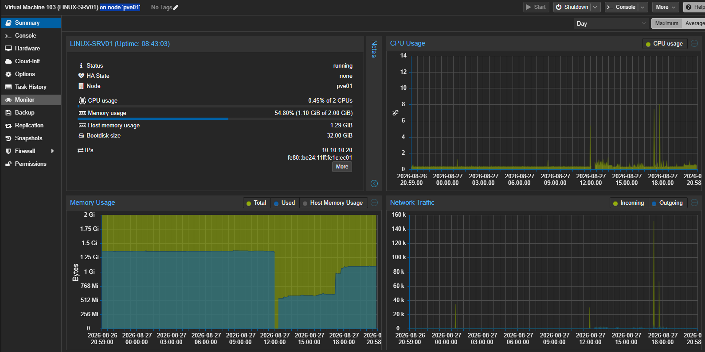

---

# 05.2 — Linux Networking

Configured the Ubuntu system to communicate with the existing HomeLab infrastructure.

Primary network interface:

```text
ens18
```

Network configuration:

```text
IP Address:     10.10.10.20/24
Gateway:        10.10.10.1
DNS Server:     10.10.10.10
Search Domain:  afhamhomelab.local
```

Network configuration was validated using:

```bash
hostnamectl
ip -br addr
ip route
resolvectl status ens18
```

DNS resolution was tested using:

```bash
resolvectl query SRV-DC01.afhamhomelab.local
```

Expected resolution:

```text
SRV-DC01.afhamhomelab.local
→ 10.10.10.10
```

The Linux DNS record was also verified:

```bash
resolvectl query linux-srv01.afhamhomelab.local
```

Result:

```text
linux-srv01.afhamhomelab.local
→ 10.10.10.20
```

This allows the Linux system to participate correctly in the internal DNS infrastructure.

### Enterprise relevance

DNS configuration is particularly important when Linux systems interact with Active Directory because AD depends heavily on DNS for domain-controller and service discovery.

### 📸 Validation

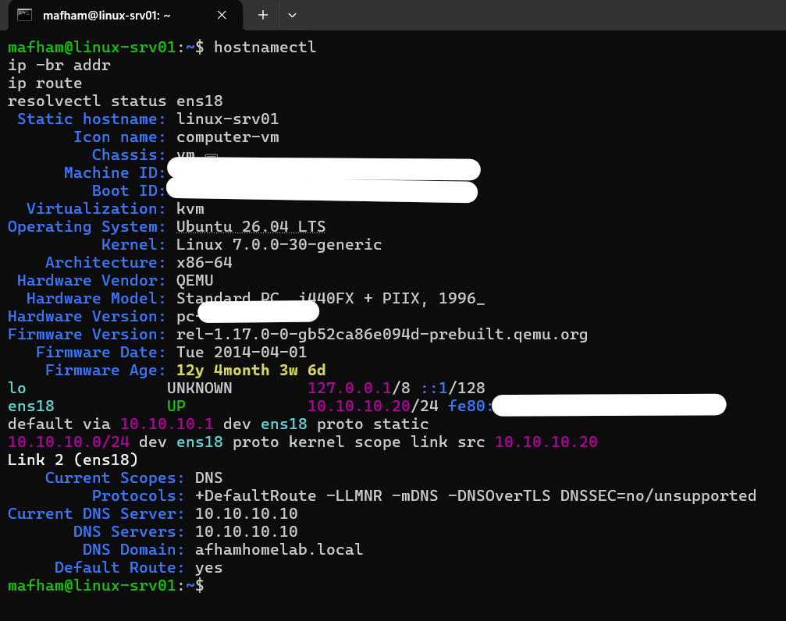

---

# 05.3 — Linux Filesystem Administration

Practiced navigation and administration of the Linux filesystem.

Commands used:

```bash
pwd
ls
ls -l
ls -la
cd
mkdir
touch
cp
mv
rm
```

Example:

```bash
pwd
```

Output:

```text
/home/mafham
```

Root filesystem inspection:

```bash
ls /
```

Important Linux directories studied:

| Directory | Purpose |
|---|---|
| `/etc` | System and application configuration |
| `/home` | User home directories |
| `/var` | Logs and variable application data |
| `/usr` | Applications, libraries and utilities |
| `/tmp` | Temporary files |
| `/srv` | Data provided by server services |
| `/root` | Root administrator home directory |
| `/boot` | Bootloader and kernel-related files |

Understanding the filesystem hierarchy is fundamental when configuring services, troubleshooting applications, managing logs and securing Linux servers.

---

# 05.4 — Linux Users and Groups

Created and managed Linux users and groups.

Commands practiced:

```bash
whoami
users
id
useradd
usermod
userdel
groupadd
groups
```

Example test account:

```text
testuser
```

Verification:

```bash
id testuser
```

Linux uses:

```text
UID → User Identifier
GID → Group Identifier
```

for identity, filesystem ownership and access control.

---

# 05.5 — Linux File Permissions

Practiced Linux ownership and permission management.

Commands used:

```bash
chmod
chown
chgrp
ls -l
```

Linux permission values:

```text
r = Read    = 4
w = Write   = 2
x = Execute = 1
```

Examples:

```text
770 = rwxrwx---
754 = rwxr-xr--
644 = rw-r--r--
660 = rw-rw----
```

A dedicated permission lab was used to validate ownership and group access.

Example:

```bash
sudo mkdir -p /srv/permission-lab
sudo touch /srv/permission-lab/test-file.txt
sudo chown testuser:itadmins /srv/permission-lab/test-file.txt
sudo chmod 660 /srv/permission-lab/test-file.txt
```

Validation:

```bash
id testuser
ls -ld /srv/permission-lab
ls -l /srv/permission-lab/test-file.txt
```

The resulting file permissions demonstrate:

```text
Owner — testuser
    Read + Write

Group — itadmins
    Read + Write

Others
    No Access
```

This demonstrates how Linux combines:

```text
User identity
      ↓
Group membership
      ↓
File ownership
      ↓
Permission bits
      ↓
Access decision
```

### 📸 Validation

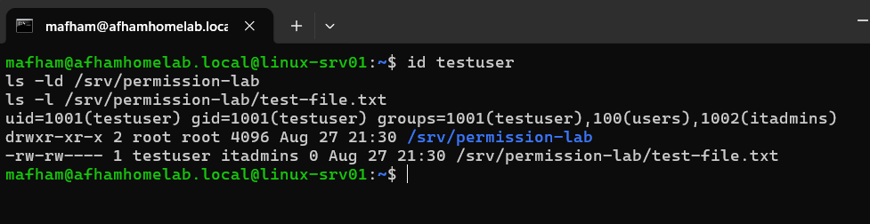

---

# 05.6 — sudo Administration

Practiced privilege elevation using:

```bash
sudo
```

Instead of routinely logging in as `root`, administrative commands are executed using an administrator's individual account.

Examples:

```bash
sudo apt update
sudo systemctl restart ssh
sudo journalctl
```

This provides better accountability and supports the **principle of least privilege**.

Conceptually:

```text
Normal User
    ↓
sudo
    ↓
Authorization Check
    ↓
Elevated Command
```

---

# 05.7 — Linux Package Management

Used Ubuntu's **APT package manager** to maintain the system.

Commands practiced:

```bash
sudo apt update
sudo apt upgrade
apt list --upgradable
sudo apt install <package>
sudo apt remove <package>
```

APT is used by Linux administrators to:

- Install software
- Apply security patches
- Update packages
- Remove software
- Maintain system security and stability

---

# 05.8 — systemd and Service Management

Practiced Linux service administration using `systemctl`.

Examples:

```bash
systemctl status ssh
systemctl is-active ssh
systemctl is-enabled ssh

sudo systemctl start ssh
sudo systemctl stop ssh
sudo systemctl restart ssh
sudo systemctl enable ssh
```

An important distinction:

```text
active
→ Service is currently running

enabled
→ Service is configured to start automatically
```

This distinction is important when troubleshooting situations where a service works now but fails to start after a reboot.

---

# 05.9 — Linux Network Troubleshooting

Used Linux networking tools to inspect connectivity, routing, DNS and listening services.

Commands included:

```bash
ip addr
ip -br addr
ip route
ping
resolvectl
ss
```

Listening ports were inspected using:

```bash
sudo ss -tulpn
```

SSH was confirmed listening on TCP port `22`.

A structured troubleshooting workflow was followed:

```text
Network Interface
       ↓
IP Address
       ↓
Routing / Gateway
       ↓
DNS
       ↓
Service Status
       ↓
Listening Port
       ↓
Host Firewall
       ↓
Network Firewall
       ↓
Client Connectivity
```

This avoids making random configuration changes when diagnosing connectivity problems.

---

# 05.10 — SSH Remote Administration

Installed and configured **OpenSSH Server** for secure remote Linux administration.

SSH service verification:

```bash
systemctl status ssh --no-pager
```

Listening-port verification:

```bash
sudo ss -tulpn | grep :22
```

Remote access from Windows:

```powershell
ssh mafham@10.10.10.20
```

SSH allows Linux servers to be securely administered without requiring direct console access.

### 📸 Validation

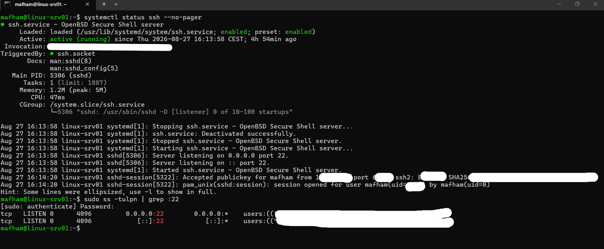

---

# 05.11 — SSH Key Authentication

Configured **Ed25519 SSH key authentication** between the Windows administrator workstation and the Linux VM.

Remote login:

```powershell
ssh mafham@10.10.10.20
```

After authentication, the Linux system was validated using:

```bash
hostname
whoami
```

SSH key authentication provides stronger administrative authentication than relying only on reusable account passwords and is widely used for Linux administration and automation.

> The SSH private key is stored only on the administrator workstation and is not included in this repository.

### 📸 Validation

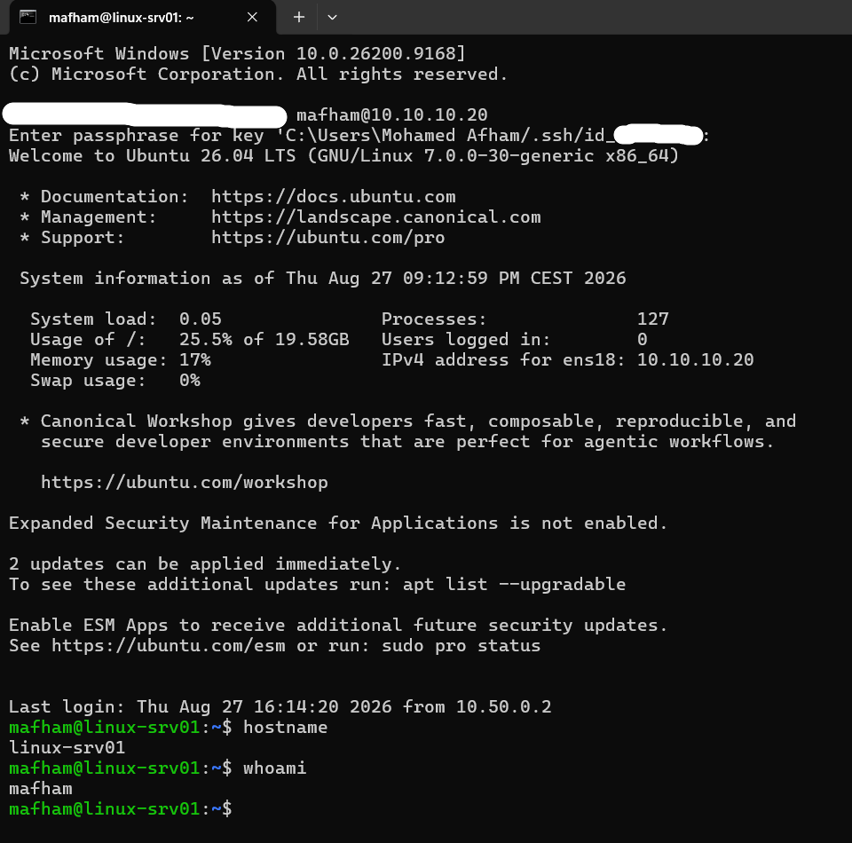

---

# 05.12 — SSH Security Hardening

Created a dedicated SSH hardening configuration:

```text
/etc/ssh/sshd_config.d/99-homelab-hardening.conf
```

Configuration:

```text
PubkeyAuthentication yes
PasswordAuthentication no
PermitRootLogin no
```

This configuration:

- Enables SSH public-key authentication
- Disables SSH password authentication
- Prevents direct root SSH login

Rather than only inspecting the configuration file, the **effective SSH configuration** was validated using:

```bash
sudo sshd -T | grep -E 'passwordauthentication|pubkeyauthentication|permitrootlogin'
```

Verified result:

```text
permitrootlogin no
pubkeyauthentication yes
passwordauthentication no
```

### Enterprise relevance

This reduces exposure to password-based SSH attacks and prevents administrators from directly logging in remotely as `root`.

### 📸 Validation

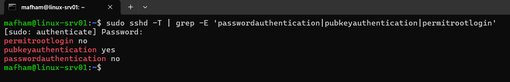

---

# 05.13 — Linux Storage and LVM

Investigated Linux storage using:

```bash
lsblk
df -h
sudo pvs
sudo vgs
sudo lvs
```

The VM uses LVM:

```text
Physical Disk
     ↓
Partition
     ↓
Physical Volume
     ↓
Volume Group
     ↓
Logical Volume
     ↓
Filesystem
```

Current layout includes:

```text
sda                     32 GB
├── sda1
├── sda2                 2 GB  /boot
└── sda3                30 GB
     └── ubuntu-vg
          └── ubuntu-lv 20 GB /
```

Approximately **10 GB remains available inside the volume group**, allowing future logical-volume expansion.

### Why enterprises use LVM

LVM provides flexible storage management and allows administrators to expand logical volumes without redesigning the complete disk layout.

### 📸 Validation

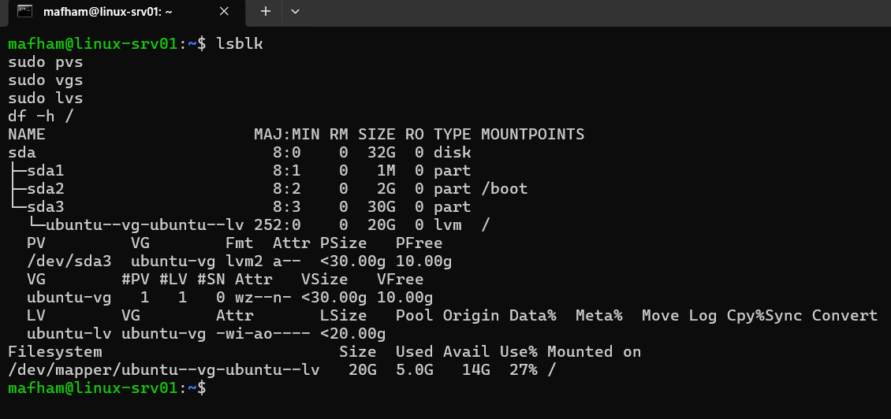

---

# 05.14 — Linux Logging

Practiced system log investigation using `journalctl`.

General system logs:

```bash
sudo journalctl
```

SSH logs:

```bash
sudo journalctl -u ssh
```

Cron logs:

```bash
sudo journalctl -u cron -n 20
```

Linux logs are essential for:

- Troubleshooting
- Security investigations
- Service monitoring
- Root-cause analysis
- Auditing

A useful enterprise troubleshooting pattern is:

```text
Service Failure
      ↓
systemctl status
      ↓
journalctl
      ↓
Configuration
      ↓
Network / Permissions
      ↓
Root Cause
```

---

# 05.15 — Bash Scripting

Created a basic Linux server health-check script:

```text
/home/mafham/server-health.sh
```

The script collects information including:

- Date and time
- Hostname
- IP address
- System uptime
- Disk utilization
- Memory utilization
- SSH service status

Execution:

```bash
/home/mafham/server-health.sh
```

This introduced practical Bash scripting for Linux administration and repeatable system checks.

---

# 05.16 — Scheduled Tasks with Cron

Configured Linux scheduled tasks using:

```bash
crontab -e
```

The server health-check script was scheduled every five minutes:

```cron
*/5 * * * * /home/mafham/server-health.sh >> /var/log/homelab/server-health.log 2>&1
```

The log destination was prepared with permissions that allow the scheduled administrative health-check process to write its output.

Cron execution can be investigated using:

```bash
sudo journalctl -u cron -n 20
```

and output can be reviewed using:

```bash
tail /var/log/homelab/server-health.log
```

Cron is commonly used for:

- Backup jobs
- Maintenance scripts
- Log processing
- Health checks
- Automated reports
- Cleanup operations

### 📸 Validation

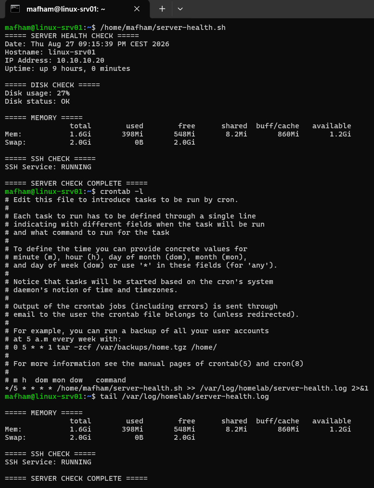

---

# 05.17 — UFW Host Firewall

Configured Ubuntu's **UFW host firewall** as an additional security layer behind pfSense.

Firewall status:

```bash
sudo ufw status verbose
```

Default policy:

```text
Incoming → Deny
Outgoing → Allow
```

Samba access was intentionally restricted to the trusted HomeLab LAN:

```text
10.10.10.0/24
```

rather than being permitted from all reachable networks.

The resulting security model is:

```text
Internet / Remote Network
          ↓
       pfSense
          ↓
   Network Firewall
          ↓
     Ubuntu UFW
          ↓
 Application / Service
```

This demonstrates **defense in depth**.

> SSH remains available for the administrative access paths used in the HomeLab. Further source-based SSH restrictions can be applied as the remote-management network design develops.

### 📸 Validation

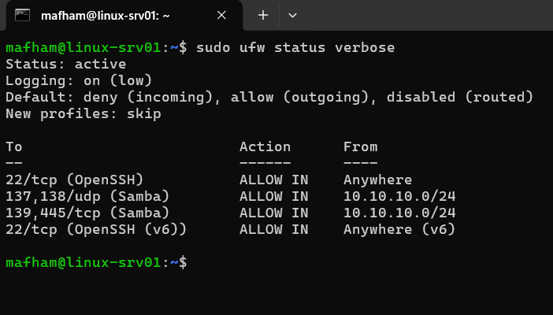

---

# 05.18 — Samba File Server

Installed and configured **Samba** to provide Windows-compatible SMB file sharing.

Created:

```text
/srv/samba/ITShare
```

Directory configuration:

```bash
sudo mkdir -p /srv/samba/ITShare
sudo chown root:itadmins /srv/samba/ITShare
sudo chmod 2770 /srv/samba/ITShare
```

The leading `2` in:

```text
2770
```

enables **setgid**.

This causes newly created files and directories to inherit the parent directory's group, helping maintain consistent group ownership in shared departmental folders.

---

# 05.19 — Samba Authentication

Created a Samba account associated with the existing Linux user:

```bash
sudo smbpasswd -a mafham
```

Enabled the account:

```bash
sudo smbpasswd -e mafham
```

Verified the Samba account database:

```bash
sudo pdbedit -L
```

This demonstrated the distinction between:

```text
Linux Local Account
        ↓
Samba Authentication
        ↓
SMB Share Authorization
```

No Samba passwords are stored in this repository.

---

# 05.20 — Enterprise-Style SMB Share

Configured:

```text
/etc/samba/smb.conf
```

with:

```ini
[ITShare]
   comment = IT Department Shared Folder
   path = /srv/samba/ITShare
   browseable = yes
   read only = no
   guest ok = no
   valid users = @itadmins
   force group = itadmins
   create mask = 0660
   directory mask = 2770
```

Before restarting Samba, the configuration was validated:

```bash
sudo testparm
```

Successful result:

```text
Loaded services file OK.
```

Samba was then restarted:

```bash
sudo systemctl restart smbd
```

This configuration combines:

```text
Authentication
      +
Linux Group Membership
      +
Filesystem Permissions
      +
Samba Share Permissions
```

to control access.

---

# 05.21 — Windows-to-Linux SMB Testing

The Samba share was tested from the Windows 11 domain client.

Windows path:

```text
\\10.10.10.20\ITShare
```

Authentication was performed using the authorized Samba account.

A file was created from Windows:

```text
Created-From-Windows.txt
```

Linux verification:

```bash
ls -l /srv/samba/ITShare
```

The test successfully demonstrated:

```text
WIN11-CL01
     ↓
SMB / TCP 445
     ↓
Ubuntu UFW
     ↓
Samba
     ↓
Linux Filesystem
     ↓
ITShare
```

This provides practical Windows/Linux interoperability experience.

### 📸 Validation

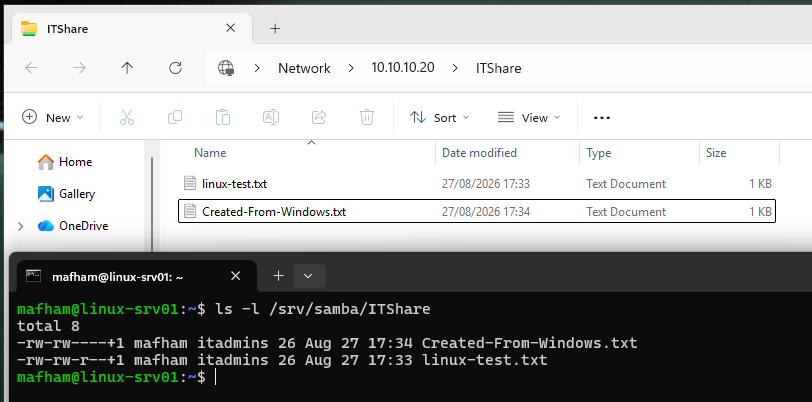

---

# 05.22 — Active Directory DNS Discovery

Before joining Linux to Active Directory, AD DNS service records were verified.

LDAP discovery:

```bash
resolvectl service _ldap._tcp.dc._msdcs.afhamhomelab.local
```

Expected service:

```text
SRV-DC01.afhamhomelab.local
10.10.10.10
TCP 389
```

Kerberos discovery:

```bash
resolvectl service _kerberos._tcp.afhamhomelab.local
```

Expected service:

```text
SRV-DC01.afhamhomelab.local
10.10.10.10
TCP 88
```

These DNS SRV records allow Linux clients to locate Active Directory services automatically.

### Enterprise relevance

A domain join depends on more than basic IP connectivity.

The dependency chain is:

```text
Network Connectivity
        ↓
DNS
        ↓
AD SRV Records
        ↓
Domain Controller Discovery
        ↓
Kerberos / LDAP
        ↓
Domain Join
```

---

# 05.23 — Linux Time Synchronization

Verified system time using:

```bash
timedatectl
```

The timezone was configured as:

```bash
sudo timedatectl set-timezone Europe/Malta
```

Validation:

```text
Time zone: Europe/Malta
System clock synchronized: yes
NTP service: active
```

Accurate time is particularly important because **Kerberos authentication is time-sensitive**.

Incorrect clock synchronization can cause authentication failures even when DNS, usernames and passwords are correct.

---

# 05.24 — Active Directory Integration Packages

Installed the required Linux/AD integration components:

```bash
sudo apt install realmd sssd sssd-tools libnss-sss libpam-sss adcli samba-common-bin oddjob oddjob-mkhomedir packagekit krb5-user -y
```

Key components:

| Component | Purpose |
|---|---|
| `realmd` | AD discovery and domain joining |
| `SSSD` | Identity, authentication and authorization integration |
| `Kerberos` | Secure ticket-based authentication |
| `adcli` | Active Directory domain operations |
| `libnss-sss` | NSS integration for SSSD identities |
| `libpam-sss` | PAM authentication through SSSD |

---

# 05.25 — Active Directory Domain Discovery

Before joining the domain:

```bash
realm discover afhamhomelab.local
```

Linux successfully discovered:

```text
realm-name: AFHAMHOMELAB.LOCAL
domain-name: afhamhomelab.local
server-software: active-directory
client-software: sssd
```

This confirmed that DNS and Active Directory discovery were functioning correctly before attempting the domain join.

---

# 05.26 — Join Ubuntu to Windows Active Directory

Joined `LINUX-SRV01` to the Windows Server 2025 Active Directory domain.

Generic join syntax:

```bash
sudo realm join afhamhomelab.local -U <authorized-domain-admin-account>
```

> Administrative credentials used during the domain join are not stored or documented in this repository.

Domain membership was verified using:

```bash
realm list
```

The result included:

```text
configured: kerberos-member
server-software: active-directory
client-software: sssd
```

SSSD verification:

```bash
systemctl is-active sssd
```

Result:

```text
active
```

The `LINUX-SRV01` computer object was successfully created in Active Directory and organized under the server OU structure.

### 📸 Linux validation

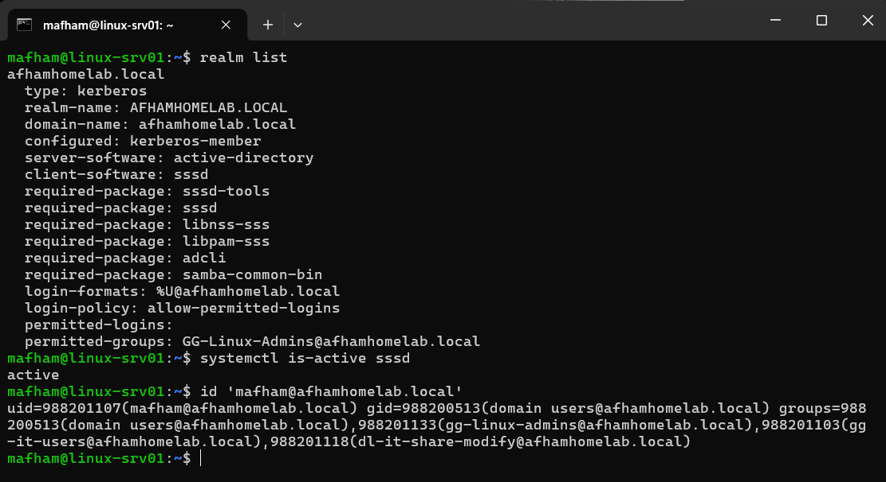

### 📸 Active Directory validation

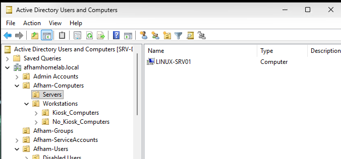

---

# 05.27 — Active Directory User Resolution

Tested whether Linux could retrieve an Active Directory identity:

```bash
id 'mafham@afhamhomelab.local'
```

Linux successfully retrieved the domain identity and associated AD group memberships.

This confirmed:

```text
LINUX-SRV01
      ↓
SSSD
      ↓
Active Directory
      ↓
Domain User
      ↓
AD Group Membership
```

This is an important distinction: Linux was no longer relying only on locally defined users.

---

# 05.28 — Active Directory Login to Linux

Enabled automatic home-directory creation for domain users:

```bash
sudo pam-auth-update --enable mkhomedir
```

Restarted SSSD:

```bash
sudo systemctl restart sssd
```

An actual Active Directory login was then tested:

```bash
su - 'mafham@afhamhomelab.local'
```

Verification:

```bash
whoami
pwd
id
```

A domain-user home directory was automatically created:

```text
/home/mafham@afhamhomelab.local
```

This successfully demonstrated:

```text
Active Directory Identity
        ↓
Kerberos / SSSD
        ↓
Linux Authentication
        ↓
PAM
        ↓
User Session
        ↓
Home Directory
```

### 📸 Validation

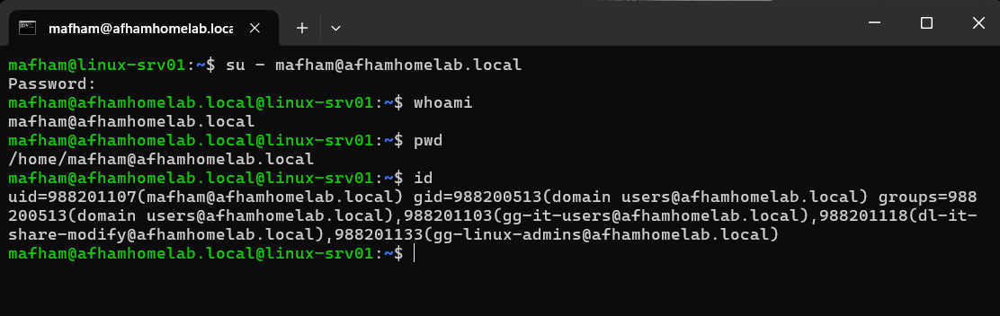

---

# 05.29 — AD Group-Based Linux Access

Created a dedicated Active Directory Global Security Group:

```text
GG-Linux-Admins
```

Authorized Linux administrators were assigned to this group.

Linux identity information was refreshed:

```bash
sudo sss_cache -E
sudo systemctl restart sssd
```

Verification:

```bash
id 'mafham@afhamhomelab.local'
```

Linux successfully detected:

```text
gg-linux-admins@afhamhomelab.local
```

This allows administrative access to be controlled centrally through Active Directory rather than maintaining independent authorization lists on every Linux system.

---

# 05.30 — Restrict Linux Login Using Active Directory Groups

Instead of allowing every domain user to access the Linux server, domain login was restricted using Active Directory group membership.

Default realm access was denied:

```bash
sudo realm deny --all
```

Then the dedicated Linux administrators group was permitted:

```bash
sudo realm permit -g 'GG-Linux-Admins@afhamhomelab.local'
```

The resulting access model:

```text
                   Active Directory
                          │
              ┌───────────┴───────────┐
              │                       │
       Standard Domain User     GG-Linux-Admins
              │                       │
              ▼                       ▼
      Linux Login DENIED       Linux Login ALLOWED
```

Positive and negative authentication tests were performed.

Authorized group member:

```text
→ Login successful
```

Standard domain user:

```text
→ Login denied
```

Generic test accounts are used in public documentation rather than identifying unrelated user accounts.

This demonstrates **least privilege and centralized group-based access control**.

---

# 05.31 — Active Directory Controlled sudo

Linux login permission and administrative privilege were intentionally treated as **separate authorization layers**.

First the AD administrator group was verified:

```bash
getent group 'GG-Linux-Admins@afhamhomelab.local'
```

A dedicated sudoers configuration was created:

```bash
sudo visudo -f /etc/sudoers.d/ad-linux-admins
```

Configuration:

```text
%gg-linux-admins@afhamhomelab.local ALL=(ALL:ALL) ALL
```

The `%` indicates that the rule applies to a **group** rather than an individual user.

Configuration validation:

```bash
sudo visudo -c
```

The sudo configuration parsed successfully.

AD administrator privilege was then tested:

```bash
sudo -l
```

followed by:

```bash
sudo whoami
```

Result:

```text
root
```

This demonstrates:

```text
Active Directory User
        ↓
AD Authentication
        ↓
GG-Linux-Admins
        ↓
Linux Login Authorization
        ↓
sudo Authorization
        ↓
Root-Level Administrative Command
```

Administrators therefore use their **individual Active Directory identities** rather than sharing a Linux root account.

### 📸 Validation

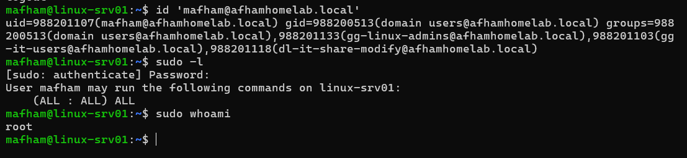

---

# 🔐 Linux Security Architecture

The resulting Linux security model combines multiple layers:

```text
                    Windows Server 2025
                         SRV-DC01
                    Active Directory
                    afhamhomelab.local
                           │
                  Kerberos / LDAP / DNS
                           │
                           ▼
                     LINUX-SRV01
                           │
              ┌────────────┼────────────┐
              │            │            │
             SSSD         UFW         Samba
              │            │            │
       AD Authentication   │         ITShare
              │            │            │
      GG-Linux-Admins      │       SMB / TCP 445
              │            │            │
       Login Permission    │        WIN11-CL01
              │            │
             sudo          │
              │            │
             root      Host Firewall
```

The overall security approach includes:

- pfSense network firewall
- Ubuntu UFW host firewall
- SSH key-based authentication
- SSH password authentication disabled
- Direct root SSH login disabled
- Samba access controls
- Linux filesystem permissions
- Active Directory authentication
- AD group-based login authorization
- AD group-based sudo authorization

---

# 🧠 Troubleshooting Methodology Practiced

Throughout the Linux stage, a structured troubleshooting methodology was followed:

```text
Identify the Problem
        ↓
Check Configuration
        ↓
Check Service Status
        ↓
Check Listening Ports
        ↓
Check IP / Routing
        ↓
Check DNS
        ↓
Check Host Firewall
        ↓
Check Network Firewall
        ↓
Check Authentication
        ↓
Check Permissions
        ↓
Review Logs
        ↓
Test from Client
        ↓
Validate Resolution
```

This approach was applied across SSH, DNS, Samba, SSSD, Active Directory integration, Linux permissions and network troubleshooting.

The goal was to identify the **root cause** rather than simply changing configuration until a service worked.

---

# 🏢 Enterprise Skills Practiced

This Linux stage provided hands-on experience with:

### Linux Administration

- Ubuntu Linux deployment
- Linux CLI administration
- Linux filesystem hierarchy
- Users and groups
- UID/GID concepts
- File ownership
- Linux permissions
- `chmod`, `chown`, and `chgrp`
- Special permissions / setgid
- sudo administration

### System Administration

- APT package management
- systemd service management
- LVM storage administration
- Linux logging with `journalctl`
- Bash scripting
- Cron scheduled tasks

### Networking & Security

- Linux IPv4 networking
- Routing
- DNS troubleshooting
- Listening-port analysis
- OpenSSH
- SSH key authentication
- SSH security hardening
- UFW host firewall
- Defense-in-depth concepts

### File Services

- Samba / SMB
- Linux filesystem permissions
- Windows-to-Linux file sharing
- Group-based shared-folder access

### Active Directory Integration

- Active Directory DNS discovery
- Kerberos
- LDAP concepts
- realmd
- SSSD
- AD domain joining
- AD identity resolution
- AD authentication on Linux
- AD security-group resolution
- Group-based Linux access
- AD-controlled sudo
- Least-privilege administration

---

# 📊 Current Status

| Linux Administration Area | Status |
|---|---|
| Linux VM Deployment | ✅ Core Stage Complete |
| Filesystem Administration | ✅ Core Stage Complete |
| Users & Groups | ✅ Core Stage Complete |
| File Permissions | ✅ Core Stage Complete |
| sudo Administration | ✅ Core Stage Complete |
| Package Management | ✅ Core Stage Complete |
| Linux Networking | ✅ Core Stage Complete |
| DNS Integration | ✅ Core Stage Complete |
| systemd / Services | ✅ Core Stage Complete |
| SSH Administration | ✅ Core Stage Complete |
| SSH Key Authentication | ✅ Core Stage Complete |
| SSH Hardening | ✅ Core Stage Complete |
| Storage & LVM | ✅ Core Stage Complete |
| Linux Logging | ✅ Core Stage Complete |
| Bash Scripting | ✅ Core Stage Complete |
| Cron / Scheduled Tasks | ✅ Core Stage Complete |
| UFW Firewall | ✅ Core Stage Complete |
| Baseline Security Hardening | ✅ Core Stage Complete |
| Samba / SMB | ✅ Core Stage Complete |
| Windows/Linux Interoperability | ✅ Core Stage Complete |
| Active Directory Integration | ✅ Core Stage Complete |
| AD Group-Based Access | ✅ Core Stage Complete |
| AD-Controlled sudo | ✅ Core Stage Complete |
| Linux Troubleshooting Exercises | ✅ Core Stage Complete |
| Debian Administration | ⏳ Planned |

---

# 🔜 Future Linux Improvements

The current Linux administration stage establishes the core Linux infrastructure and administration baseline.

Future exercises may include:

- Debian deployment and administration
- Advanced Linux storage
- Filesystem expansion and recovery
- SSH source-network restrictions
- Advanced UFW policies
- Fail2ban
- Centralized Linux logging
- Linux monitoring
- Backup and recovery
- Advanced Bash scripting
- Configuration automation
- Ansible
- Docker / container administration
- Linux server hardening
- Additional AD-integrated Linux systems

These items are intentionally listed as future work and are not represented as completed.

---

# 🏆 Key Outcome

`LINUX-SRV01` is no longer an isolated Linux virtual machine.

It is integrated into the wider Enterprise HomeLab:

```text
Proxmox VE
     ↓
Linux Virtual Machine
     ↓
pfSense Networking & Security
     ↓
Windows Server DNS
     ↓
Active Directory
     ↓
Kerberos + SSSD
     ↓
AD Security Groups
     ↓
Linux Login Authorization
     ↓
sudo Authorization
     ↓
Samba / SMB
     ↓
Windows Client
```

This stage provided practical experience administering Linux within a mixed **Windows + Linux enterprise-style infrastructure**, with particular focus on networking, security, identity, authorization, troubleshooting and interoperability.

---

# 🔒 Public Repository Security

This documentation is intended for educational and portfolio purposes.

The following information is intentionally excluded or redacted:

- Passwords
- SSH private keys
- VPN private keys
- API keys and authentication tokens
- Recovery keys
- Administrative credentials
- Sensitive machine identifiers
- Unnecessary personal information

Private RFC1918 addresses, HomeLab hostnames and the isolated lab domain may appear in screenshots and documentation because they represent only the non-production HomeLab environment.

---

**Build → Configure → Secure → Integrate → Test → Troubleshoot → Validate → Document → Improve**
