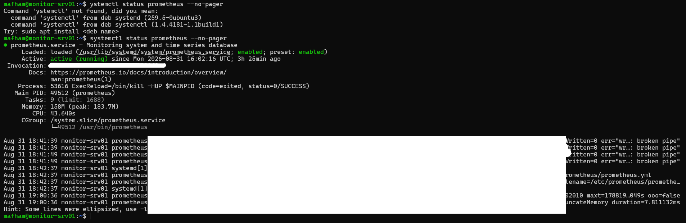
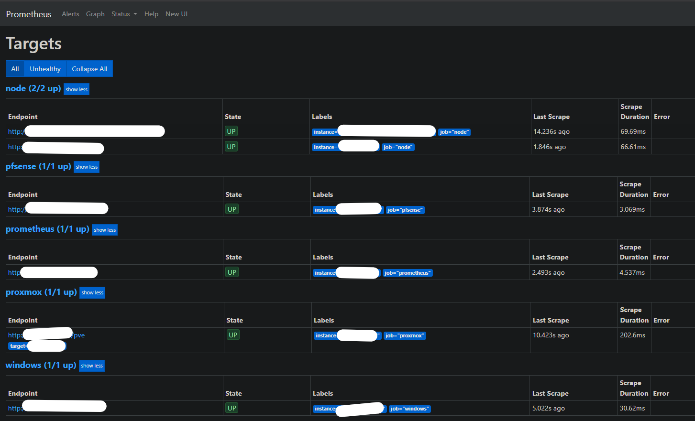
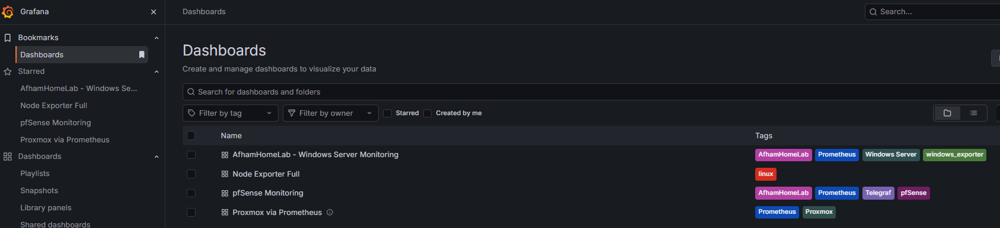
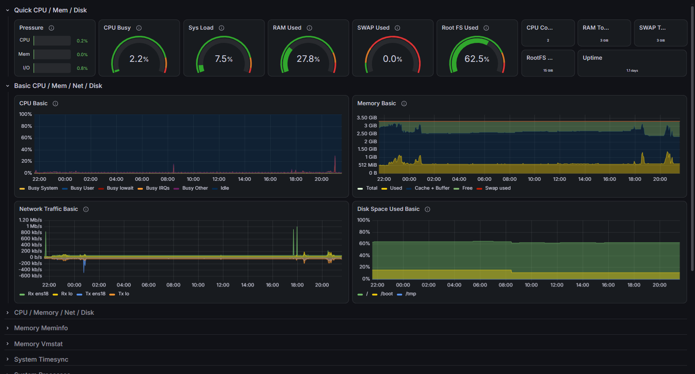
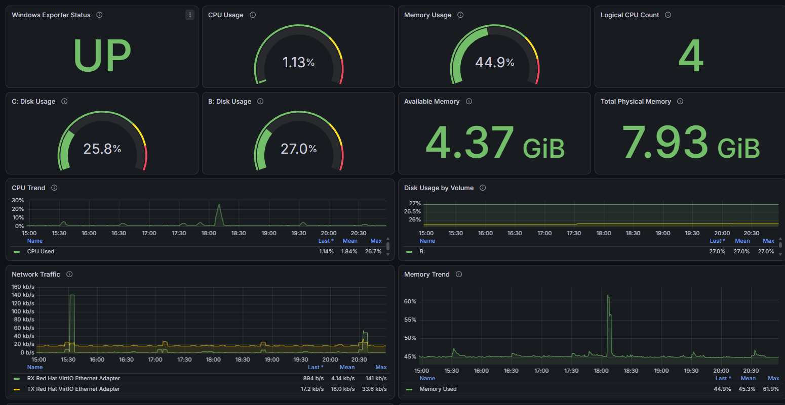
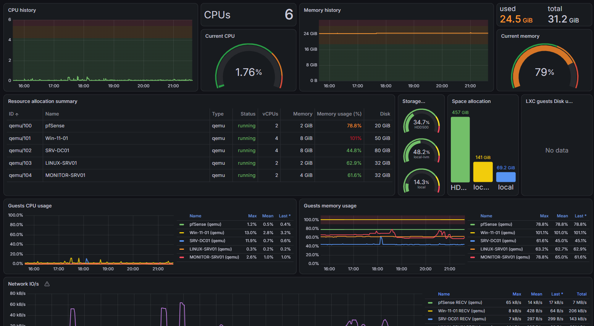
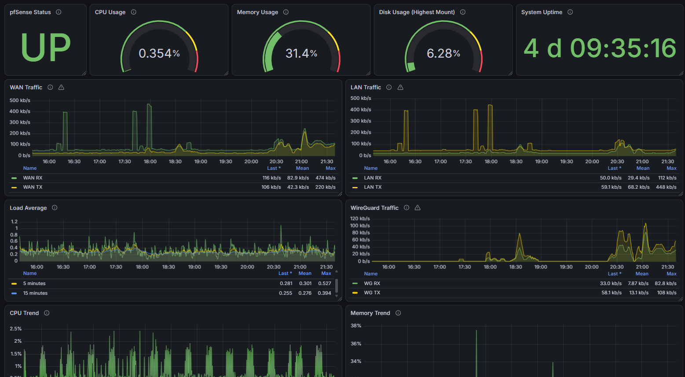
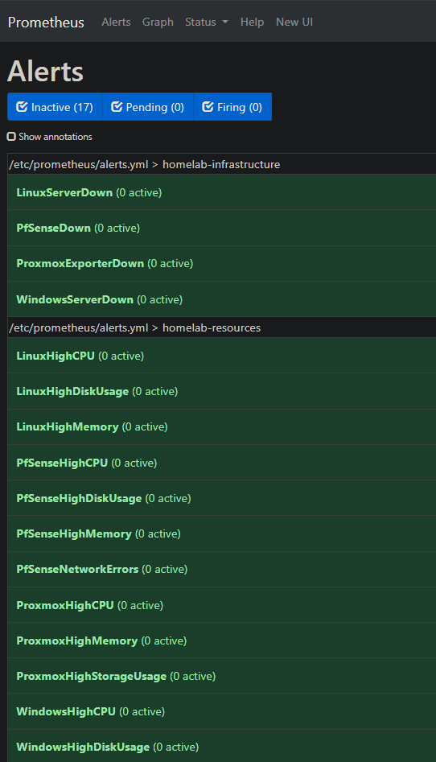
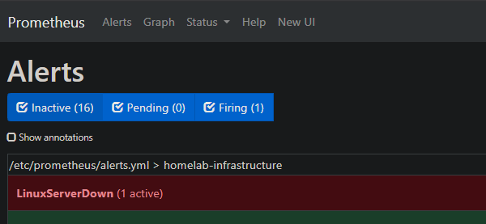
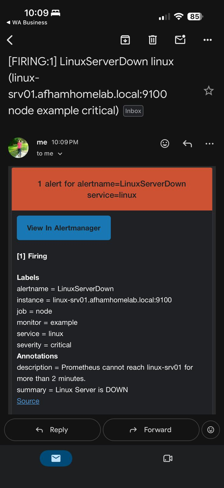

# 📊 06 — Monitoring & Observability

This stage of the Enterprise HomeLab focuses on implementing **centralized infrastructure monitoring, visualization, alerting, and proactive fault detection**.

The objective was to move beyond simply deploying and administering infrastructure and introduce an enterprise-style monitoring workflow where system health, performance, availability, and resource utilization can be observed from a central platform.

The completed environment uses **Prometheus and Grafana** to monitor Linux, Windows, Proxmox, and pfSense infrastructure, with **Prometheus alert rules and Alertmanager email notifications** providing proactive incident detection.

---

## 🎯 Objectives

The main objectives of this stage were to:

- Deploy a dedicated monitoring server
- Install and configure Prometheus
- Install and configure Grafana
- Monitor Linux server infrastructure
- Monitor Windows infrastructure
- Monitor Proxmox virtualization
- Monitor pfSense firewall infrastructure
- Create centralized Grafana dashboards
- Monitor CPU, memory, disk, network, and uptime
- Create infrastructure availability alerts
- Create resource utilization alerts
- Configure Alertmanager
- Configure email alert notifications
- Simulate an infrastructure monitoring failure
- Validate the complete alerting workflow
- Practice monitoring-based troubleshooting

---

# 🏗️ Monitoring Architecture

The monitoring platform is hosted on a dedicated Linux monitoring server.

```text
                    ┌────────────────────────────┐
                    │       MONITOR-SRV01        │
                    │                            │
                    │  Prometheus                │
                    │  Grafana                   │
                    │  Alertmanager              │
                    └─────────────┬──────────────┘
                                  │
                         Metrics Collection
                                  │
              ┌───────────────────┼───────────────────┐
              │                   │                   │
              ▼                   ▼                   ▼
        Linux Systems        Windows Systems      Proxmox VE
        Node Exporter        Windows Exporter      Metrics
              │                   │                   │
              └───────────────────┼───────────────────┘
                                  │
                                  ▼
                               pfSense
                               Metrics

                                  │
                                  ▼
                              Prometheus
                                  │
                    ┌─────────────┴─────────────┐
                    │                           │
                    ▼                           ▼
                 Grafana                  Alert Rules
                 Dashboards                    │
                                               ▼
                                         Alertmanager
                                               │
                                               ▼
                                        Email Notification
```

---

# 🖥️ Monitoring Server

A dedicated Linux VM was deployed for centralized monitoring.

```text
Hostname: MONITOR-SRV01
Role: Centralized Monitoring Server
Platform: Ubuntu Linux
```

The monitoring server hosts the core monitoring services and provides a centralized platform for collecting and visualizing infrastructure metrics.

### Enterprise Purpose

Separating monitoring services from production or infrastructure workloads provides centralized visibility and allows administrators to detect failures even when individual monitored systems experience problems.

---

# 📡 06.1 — Prometheus Deployment

**Prometheus** was deployed as the central metrics collection platform.

Prometheus collects time-series metrics from configured infrastructure targets using exporters and monitoring endpoints.

It provides the foundation for:

- Infrastructure health monitoring
- Performance monitoring
- Resource utilization monitoring
- Availability monitoring
- Alert rule evaluation
- Grafana visualization

The Prometheus service was configured to start automatically and verified as operational.

### Validation

```bash
systemctl status prometheus --no-pager
```

Expected result:

```text
Active: active (running)
```

### 📸 Evidence



---

# 🎯 06.2 — Prometheus Target Configuration

Prometheus scrape targets were configured for the main HomeLab infrastructure.

The monitored targets include:

- Linux
- Windows
- pfSense
- Proxmox
- Prometheus itself

Prometheus periodically connects to these endpoints and retrieves metrics.

A healthy target appears as:

```text
UP
```

A failed or unreachable monitoring target appears as:

```text
DOWN
```

This allows infrastructure availability to be centrally monitored.

### Monitoring Flow

```text
Infrastructure
      │
      ▼
Exporter / Metrics Endpoint
      │
      ▼
Prometheus Scrape
      │
      ▼
Time-Series Metrics
```

### 📸 Evidence



The Prometheus Targets page confirms that Linux, Windows, Proxmox, pfSense, and Prometheus monitoring endpoints are successfully reporting.

---

# 📊 06.3 — Grafana Deployment

**Grafana** was deployed as the visualization layer for the monitoring environment.

Prometheus was configured as a Grafana data source.

Grafana converts Prometheus metrics into dashboards that allow infrastructure health and performance to be reviewed from a centralized interface.

Dedicated dashboards were configured for:

- Windows Server
- Linux
- Proxmox
- pfSense

This provides a single monitoring interface across multiple infrastructure platforms.

### Enterprise Purpose

Operations and infrastructure teams use centralized dashboards to quickly identify:

- Performance degradation
- Resource exhaustion
- Server availability issues
- Network utilization changes
- Storage problems
- Infrastructure failures

### 📸 Evidence



---

# 🐧 06.4 — Linux Monitoring

Linux infrastructure monitoring was implemented using **Prometheus Node Exporter**.

Node Exporter exposes Linux operating-system metrics through a Prometheus-compatible endpoint.

The Linux monitoring configuration provides visibility into:

- CPU utilization
- Memory utilization
- System load
- Filesystem usage
- Disk utilization
- Network traffic
- System uptime
- System resource pressure

### Monitoring Flow

```text
LINUX-SRV01
     │
     ▼
Prometheus Node Exporter
     │
     ▼
TCP 9100
     │
     ▼
Prometheus
     │
     ▼
Grafana
```

The Node Exporter service on Ubuntu is managed through:

```bash
prometheus-node-exporter.service
```

Service validation can be performed with:

```bash
systemctl status prometheus-node-exporter --no-pager
```

### 📸 Evidence



The Linux Grafana dashboard provides centralized visibility into CPU, memory, disk, filesystem, network, system load, and uptime.

---

# 🪟 06.5 — Windows Monitoring

Windows infrastructure monitoring was implemented using **Windows Exporter**.

Windows Exporter exposes Windows performance metrics in a format that Prometheus can collect.

The Windows monitoring dashboard provides visibility into:

- Exporter availability
- CPU utilization
- Memory utilization
- Logical CPU count
- Available memory
- Total physical memory
- Disk utilization
- CPU trends
- Memory trends
- Network traffic

### Monitoring Flow

```text
Windows Server
      │
      ▼
Windows Exporter
      │
      ▼
Prometheus
      │
      ▼
Grafana
```

This demonstrates centralized monitoring across both Linux and Windows operating systems.

### 📸 Evidence



---

# 🖥️ 06.6 — Proxmox Monitoring

The **Proxmox VE virtualization environment** was integrated into the monitoring platform.

The Proxmox dashboard provides centralized visibility into both host-level and virtual-machine resource utilization.

Monitoring includes:

- Proxmox host CPU utilization
- Host memory utilization
- Storage utilization
- Virtual machine status
- VM CPU utilization
- VM memory utilization
- Resource allocation
- Network activity
- Guest resource consumption

The dashboard provides visibility into the HomeLab virtual infrastructure from a single interface.

### Monitored Virtual Machines

The monitoring platform can observe the primary virtual machines running within the Proxmox environment, including:

```text
pfSense
WIN11-01
SRV-DC01
LINUX-SRV01
MONITOR-SRV01
```

### Enterprise Purpose

Virtualization monitoring allows infrastructure administrators to determine whether performance issues originate from:

```text
Physical Host
     ↓
Virtualization Layer
     ↓
Virtual Machine
     ↓
Operating System / Service
```

### 📸 Evidence



---

# 🔥 06.7 — pfSense Monitoring

The **pfSense firewall** was integrated into the centralized monitoring platform.

This extends observability beyond servers and into the network/security infrastructure.

The pfSense Grafana dashboard provides visibility into:

- Firewall availability
- CPU utilization
- Memory utilization
- Disk utilization
- System uptime
- WAN traffic
- LAN traffic
- Load average
- WireGuard traffic
- CPU trends
- Memory trends

### Monitoring Flow

```text
pfSense
   │
   ▼
Metrics Collection
   │
   ▼
Prometheus
   │
   ▼
Grafana
```

### Enterprise Purpose

Monitoring firewall infrastructure allows administrators to correlate network performance with server and application behavior.

For example:

```text
User reports slow connection
        ↓
Check pfSense WAN/LAN traffic
        ↓
Check firewall resource usage
        ↓
Check WireGuard traffic
        ↓
Check server metrics
        ↓
Identify affected layer
```

### 📸 Evidence



---

# 🚨 06.8 — Prometheus Alert Rules

Monitoring dashboards provide visibility, but administrators should not need to continuously watch dashboards.

For this reason, **Prometheus alert rules** were configured to proactively detect infrastructure failures and resource problems.

The completed environment contains:

```text
17 Prometheus Alert Rules
```

The alert rules cover multiple infrastructure platforms.

---

## Infrastructure Availability Alerts

Availability alerts detect when important monitoring endpoints become unreachable.

Examples include:

```text
LinuxServerDown
PfSenseDown
ProxmoxExporterDown
WindowsServerDown
```

These rules help identify infrastructure outages automatically.

---

## Linux Resource Alerts

Linux monitoring includes alerts for conditions such as:

```text
LinuxHighCPU
LinuxHighMemory
LinuxHighDiskUsage
```

---

## Windows Resource Alerts

Windows monitoring includes alerts for conditions such as:

```text
WindowsHighCPU
WindowsHighMemory
WindowsHighDiskUsage
```

---

## pfSense Resource Alerts

pfSense monitoring includes alerts such as:

```text
PfSenseHighCPU
PfSenseHighMemory
PfSenseHighDiskUsage
PfSenseNetworkErrors
```

---

## Proxmox Resource Alerts

Proxmox monitoring includes alerts such as:

```text
ProxmoxHighCPU
ProxmoxHighMemory
ProxmoxHighStorageUsage
```

---

## Alert States

Prometheus alert rules can transition through different states:

```text
INACTIVE
   │
   ▼
PENDING
   │
   ▼
FIRING
```

### Inactive

The monitored condition is healthy.

### Pending

The alert condition has been detected but has not yet exceeded the configured duration.

### Firing

The condition has remained active beyond the configured threshold and requires investigation.

### 📸 Evidence



The screenshot demonstrates that the alert rules are successfully loaded into Prometheus and actively evaluating infrastructure conditions.

---

# 🧪 06.9 — Alert Failure Simulation

Alerting was tested by deliberately creating a controlled monitoring failure.

Rather than generating excessive CPU load or filling a filesystem, the Linux Node Exporter service was temporarily stopped.

This provided a safe method of simulating loss of monitoring availability.

The service used on Ubuntu is:

```bash
prometheus-node-exporter.service
```

The test was initiated with:

```bash
sudo systemctl stop prometheus-node-exporter
```

Prometheus subsequently detected that the Linux monitoring endpoint on TCP port `9100` was unavailable.

The configured rule:

```text
LinuxServerDown
```

requires the condition to remain active for approximately two minutes before generating a critical alert.

### Test Workflow

```text
LINUX-SRV01 Healthy
        │
        ▼
Node Exporter Stopped
        │
        ▼
TCP 9100 Unavailable
        │
        ▼
Prometheus Scrape Fails
        │
        ▼
Linux Target = DOWN
        │
        ▼
LinuxServerDown = PENDING
        │
        ▼
Configured Duration Exceeded
        │
        ▼
LinuxServerDown = FIRING
```

The test successfully resulted in:

```text
Inactive: 16
Pending:   0
Firing:    1
```

with:

```text
LinuxServerDown (1 active)
```

### 📸 Evidence



This confirms that Prometheus successfully detected the simulated Linux monitoring failure.

---

# 📧 06.10 — Alertmanager Email Notification

Prometheus alerting was integrated with **Alertmanager** to deliver notifications when critical monitoring conditions occur.

During the Linux failure simulation, the `LinuxServerDown` alert was forwarded to Alertmanager and successfully delivered by email.

The notification contained information including:

- Alert name
- Affected system
- Monitoring job
- Service
- Severity
- Alert description
- Alert summary
- Link to Alertmanager

Example alert:

```text
Alert: LinuxServerDown
Service: linux
Severity: critical
Status: FIRING
```

The alert description identified that Prometheus had been unable to reach the Linux monitoring endpoint for longer than the configured threshold.

### End-to-End Alert Flow

```text
LINUX-SRV01
     │
     │ Node Exporter unavailable
     ▼
Prometheus
     │
     │ LinuxServerDown
     ▼
Alert Rule
     │
     │ FIRING
     ▼
Alertmanager
     │
     ▼
Email Notification
     │
     ▼
Administrator
```

### 📸 Evidence



This validates the complete monitoring and notification workflow rather than only confirming that alert rules exist.

---

# 🔄 06.11 — Service Recovery Validation

After successfully testing the alert, the Linux Node Exporter service was restored.

```bash
sudo systemctl start prometheus-node-exporter
```

Service status was verified using:

```bash
systemctl status prometheus-node-exporter --no-pager
```

Expected state:

```text
Active: active (running)
```

TCP port `9100` can also be verified with:

```bash
sudo ss -lntp | grep 9100
```

After the exporter was restored:

```text
Node Exporter Running
        ↓
Prometheus Scrape Successful
        ↓
Linux Target = UP
        ↓
LinuxServerDown Condition Cleared
        ↓
Alert Returns to INACTIVE
```

This completes the monitoring incident lifecycle:

**Detect → Alert → Investigate → Recover → Validate**

---

# 🔍 06.12 — Monitoring-Based Troubleshooting

An important part of this stage was learning how monitoring changes the troubleshooting process.

Without centralized monitoring, troubleshooting often starts by manually connecting to individual systems.

With centralized monitoring, administrators can first determine which infrastructure layer is affected.

### Troubleshooting Workflow

```text
Problem Reported / Alert Received
             │
             ▼
        Check Grafana
             │
             ▼
     Identify Affected System
             │
             ▼
   Check CPU / RAM / Disk / Network
             │
             ▼
      Check Prometheus Target
             │
             ▼
       Check Alert State
             │
             ▼
     Connect to Affected System
             │
             ▼
       Identify Root Cause
             │
             ▼
          Resolve
             │
             ▼
 Verify Monitoring Returns to Normal
```

This is closer to how infrastructure and operations teams troubleshoot production environments.

---

# 🧠 06.13 — Troubleshooting Experience

During the monitoring deployment, several areas required troubleshooting and validation.

These included:

- Prometheus service status
- Prometheus scrape targets
- Exporter connectivity
- Prometheus job configuration
- Linux Node Exporter service identification
- Windows Exporter metrics
- Grafana data-source configuration
- Grafana dashboard data-source mapping
- Dashboard variables
- pfSense metrics collection
- Proxmox metrics collection
- Telegraf service operation
- Prometheus alert rule syntax
- Alert thresholds
- Alert rule evaluation
- Alertmanager notification delivery
- Simulated monitoring failures
- Monitoring recovery validation

A key lesson was to validate the actual Linux service name before attempting service management.

For example, the Ubuntu package uses:

```text
prometheus-node-exporter.service
```

rather than:

```text
node_exporter.service
```

This reinforces an important administration principle:

> **Verify the environment before making changes instead of assuming service names or configurations.**

---

# 📈 06.14 — Metrics Monitoring Model

The monitoring environment uses a metrics-based architecture.

```text
System
   │
   ▼
Exporter / Metrics Endpoint
   │
   ▼
Prometheus
   │
   ├──────────────► Alert Rules
   │                     │
   │                     ▼
   │                Alertmanager
   │                     │
   │                     ▼
   │                    Email
   │
   ▼
Grafana
   │
   ▼
Dashboards
```

Each component has a specific responsibility.

| Component | Purpose |
|---|---|
| Prometheus | Metrics collection and alert evaluation |
| Grafana | Visualization and dashboards |
| Node Exporter | Linux operating-system metrics |
| Windows Exporter | Windows operating-system metrics |
| Telegraf / Metrics Exporters | Additional infrastructure metrics |
| Alertmanager | Alert processing and notification delivery |
| Email | Administrator alert notification |

---

# 🏢 06.15 — Enterprise Monitoring Concepts Practiced

This stage introduced several concepts commonly used by infrastructure and operations teams.

### Centralized Monitoring

Multiple infrastructure systems are observed from a single platform.

### Availability Monitoring

Prometheus identifies when monitored systems or exporters become unreachable.

### Resource Monitoring

CPU, memory, disk, network, and other system metrics are continuously collected.

### Visualization

Grafana converts raw metrics into operational dashboards.

### Threshold-Based Alerting

Prometheus evaluates predefined conditions and durations.

### Alert Management

Alertmanager processes firing alerts and handles notification delivery.

### Proactive Operations

Administrators can be notified of infrastructure problems before users report them.

### Failure Simulation

Controlled failures validate whether monitoring systems actually detect problems.

### Recovery Validation

Monitoring confirms when affected infrastructure returns to a healthy state.

---

# 🛠️ Technologies Used

| Technology | Purpose |
|---|---|
| **Ubuntu Linux** | Monitoring server platform |
| **Prometheus** | Central metrics collection |
| **Grafana** | Dashboards and visualization |
| **Node Exporter** | Linux system metrics |
| **Windows Exporter** | Windows system metrics |
| **Telegraf** | Infrastructure metrics collection |
| **Proxmox VE Metrics** | Virtualization monitoring |
| **pfSense Metrics** | Firewall and network monitoring |
| **Prometheus Alert Rules** | Infrastructure fault detection |
| **Alertmanager** | Alert processing and routing |
| **Email Notifications** | Administrator alert delivery |

---

# 📊 Monitoring Coverage

| Infrastructure | Metrics | Dashboard | Availability Alert | Resource Alerts |
|---|:---:|:---:|:---:|:---:|
| Linux | ✅ | ✅ | ✅ | ✅ |
| Windows | ✅ | ✅ | ✅ | ✅ |
| Proxmox VE | ✅ | ✅ | ✅ | ✅ |
| pfSense | ✅ | ✅ | ✅ | ✅ |
| Prometheus | ✅ | — | — | — |

---

# 🚨 Alert Coverage

The completed monitoring configuration contains **17 Prometheus alert rules** covering infrastructure availability and resource utilization.

Key monitoring categories include:

| Category | Examples |
|---|---|
| Availability | Linux, Windows, Proxmox, pfSense |
| CPU | High CPU utilization |
| Memory | High memory utilization |
| Storage | High disk/storage utilization |
| Network | pfSense network errors |
| Monitoring Endpoint | Exporter availability |

---

# 🔐 Security Considerations

Monitoring infrastructure can contain sensitive operational information.

For this reason, public GitHub documentation excludes or redacts:

- Passwords
- API tokens
- Authentication tokens
- SMTP credentials
- Grafana credentials
- Proxmox API credentials
- Private keys
- VPN credentials
- Session cookies
- Public IP addresses
- Other authentication secrets

Private RFC1918 addresses and internal HomeLab hostnames may appear because they belong only to the isolated lab environment.

---

# 🔮 Future Improvements

The current stage focuses primarily on **metrics, dashboards, alerting, and notification delivery**.

Future monitoring improvements may include:

- Deploy Loki for centralized log aggregation
- Deploy Grafana Alloy or another supported log collector
- Centralize Linux system logs
- Forward pfSense logs to the centralized logging platform
- Correlate metrics and logs inside Grafana
- Add Windows Event Log integration
- Expand Alertmanager routing
- Add additional notification channels
- Implement monitoring configuration backup
- Add monitoring for future Docker/container workloads
- Create service-level dashboards
- Add additional availability probes
- Expand monitoring as new HomeLab infrastructure is deployed

---

# 🎯 Key Outcome

Stage 06 transformed the HomeLab from infrastructure that could primarily be administered individually into infrastructure that can be **centrally monitored and proactively observed**.

The completed monitoring workflow is:

```text
Infrastructure
      ↓
Exporters / Metrics
      ↓
Prometheus
      ↓
┌───────────────┬────────────────┐
│               │                │
▼               ▼                ▼
Metrics      Alert Rules       Grafana
                │             Dashboards
                ▼
           Alertmanager
                │
                ▼
              Email
```

The alert simulation further validated the complete incident lifecycle:

```text
Healthy Infrastructure
        ↓
Controlled Failure
        ↓
Prometheus Detection
        ↓
Alert Pending
        ↓
Alert Firing
        ↓
Alertmanager
        ↓
Email Notification
        ↓
Administrator Investigation
        ↓
Service Recovery
        ↓
Prometheus Target UP
        ↓
Alert Resolved
```

---

# 🏆 Skills Practiced

- Infrastructure monitoring
- Prometheus administration
- Grafana administration
- Linux monitoring
- Windows monitoring
- Proxmox monitoring
- pfSense monitoring
- Node Exporter
- Windows Exporter
- Telegraf
- Prometheus query concepts
- Metrics collection
- Dashboard administration
- Infrastructure availability monitoring
- Resource monitoring
- Alert rule configuration
- Warning and critical thresholds
- Alertmanager
- Email alert notifications
- Failure simulation
- Incident detection
- Service recovery validation
- Monitoring-based troubleshooting
- Cross-platform observability

---

# 📸 Evidence Summary

| Screenshot | Evidence |
|---|---|
| `01-prometheus-service.png` | Prometheus service operational |
| `02-prometheus-targets.png` | Infrastructure monitoring targets UP |
| `03-grafana-dashboards.png` | Centralized Grafana dashboard environment |
| `04-linux-dashboard.png` | Linux system monitoring |
| `05-windows-dashboard.png` | Windows system monitoring |
| `06-proxmox-dashboard.png` | Proxmox virtualization monitoring |
| `07-pfsense-dashboard.png` | pfSense firewall/network monitoring |
| `08-alert-rules.png` | Prometheus alert rules |
| `09-alert-firing.png` | Simulated Linux failure detected |
| `10-email-alert-notification.jpeg` | Alertmanager email notification delivered |

---

## 💡 Final Result

The HomeLab now includes a centralized monitoring platform capable of observing multiple infrastructure layers and proactively detecting system failures.

Rather than waiting for users to report problems, the environment can identify infrastructure conditions, trigger alerts, and notify an administrator.

This stage provides practical experience with the operational monitoring lifecycle used in enterprise infrastructure environments:

> **Observe → Detect → Alert → Investigate → Recover → Validate → Improve**

---

**Stage 06 — Monitoring & Observability ✅ Completed**
