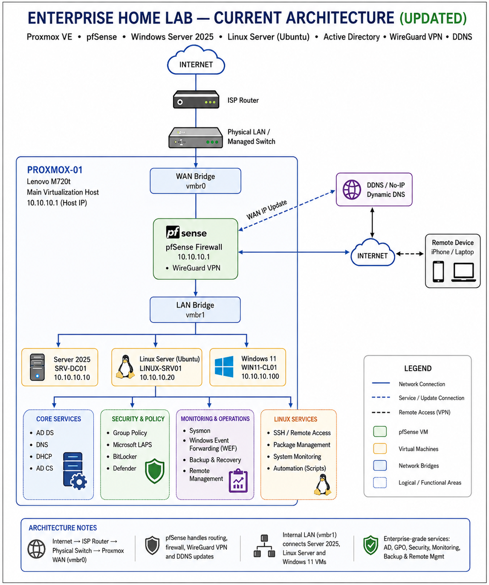

# 🏠 Enterprise HomeLab

> A hands-on enterprise-style HomeLab built to develop practical skills in IT infrastructure, virtualization, networking, security, Linux, monitoring, and automation.

---

## 👋 About This Project

This repository documents my personal Enterprise HomeLab, built for hands-on learning, experimentation, troubleshooting, and infrastructure development.

Rather than simply installing technologies, I use the environment to deploy services, apply security controls, test configurations, troubleshoot failures, perform recovery exercises, automate administrative tasks, and document what I learn.

The goal is not simply to install different technologies.

I use this environment to:

* Deploy infrastructure
* Configure enterprise services
* Apply security controls
* Test configurations
* Troubleshoot problems
* Simulate failures
* Recover systems
* Automate administrative tasks
* Document everything I learn

The HomeLab is continuously expanding as I develop my skills across **Windows, Linux, networking, virtualization, security, monitoring, storage, and automation**.

---

# 🎯 My Goal

My goal is to build a small but realistic enterprise-style infrastructure where I can develop practical skills across systems, networking, security, virtualization, automation, and infrastructure operations.

The learning process follows:

```text
Plan
  ↓
Deploy
  ↓
Configure
  ↓
Secure
  ↓
Test
  ↓
Troubleshoot
  ↓
Recover
  ↓
Document
  ↓
Improve
```

Troubleshooting and recovery are intentionally documented because diagnosing failures is a key part of infrastructure administration.

---

# 🖥️ HomeLab Infrastructure

My lab currently uses:

| Hardware               | Purpose                               |
| ---------------------- | ------------------------------------- |
| Lenovo M720t           | Primary Proxmox virtualization server |
| Lenovo M910q x 2       | Available for multi-node / cluster expansion               |
| Managed Switch         | Network connectivity                  |
| Additional HDD Storage | Backup and storage                    |

## 🏗️ Current Architecture

The diagram below represents the current architecture of my Enterprise HomeLab, including Proxmox VE, pfSense, Windows Server 2025, Active Directory services, WireGuard VPN, DDNS, security controls, monitoring, and backup components.



---

# 📚 Project Documentation

The repository is organized by **major infrastructure technologies**.

Detailed installation steps, configuration, commands, screenshots, testing, troubleshooting, and lessons learned are stored inside each project folder.

---

## 01 — Proxmox Virtualization ✅

Built the virtualization platform used to host the HomeLab infrastructure.

Covered:

* Proxmox VE installation
* Virtual machines
* Virtual networking
* Linux bridges
* Storage
* Backup storage
* VM management
* Troubleshooting

➡️ **[View Proxmox Documentation](./01-proxmox/)**

---

## 02 — pfSense Firewall ✅

Deployed pfSense to provide firewalling, networking, and secure remote access for the HomeLab.

Covered:

* WAN/LAN configuration
* Firewall rules
* NAT
* Network aliases
* DNS
* Dynamic DNS
* WireGuard VPN
* Secure remote access
* Firewall troubleshooting

➡️ **[View pfSense Documentation](./02-pfsense/)**

---

## 03 — Windows Server 2025 ✅

Deployed Windows Server 2025 and configured the main Windows infrastructure services used throughout the lab.

Covered:

- Windows Server 2025 deployment
- DNS and DHCP
- Group Policy
- Active Directory Certificate Services
- Microsoft LAPS
- BitLocker and Windows security policies
- Sysmon and Windows Event Forwarding
- Windows Server Backup
- Remote administration
- Troubleshooting and recovery

➡️ **[View Windows Server 2025 Documentation](./03-windows-server-2025/)**

---

## 04 — Active Directory ✅

Built an enterprise-style Active Directory environment for centralized identity and access management.

Covered:

* Active Directory Domain Services
* Organizational Units
* Users and groups
* AGDLP
* Administrative accounts
* Delegation
* Password policies
* Fine-Grained Password Policies
* Active Directory Sites & Services
* FSMO roles
* AD health validation
* Active Directory Recycle Bin
* gMSA
* PowerShell administration
* Troubleshooting

➡️ **[View Active Directory Documentation](./04-active-directory/)**

---

## 🐧 05 — Linux Administration ✅

Deployed an Ubuntu Linux system and integrated it into the existing Windows-based HomeLab infrastructure.

### Implemented

- Linux networking and internal DNS
- Users, groups and filesystem permissions
- sudo and least-privilege administration
- APT package management
- systemd service management
- SSH remote administration
- Ed25519 key-based authentication
- SSH security hardening
- LVM storage administration
- Linux logging with journalctl
- Bash scripting and cron automation
- UFW host firewall
- Samba / SMB file sharing
- Windows-to-Linux interoperability
- Active Directory domain integration
- SSSD and Kerberos authentication
- AD group-based Linux login
- AD-controlled sudo authorization

**Key outcome:** Linux authentication and administrative access can be centrally controlled through Active Directory security groups.

➡️ [View Linux Administration Documentation](05-Linux%20Administration/README.md)

---

## 📊 06 — Monitoring & Observability ✅

Implemented a centralized monitoring and alerting platform for the Enterprise HomeLab using **Prometheus, Grafana, exporters, and Alertmanager**.

### Implemented

- Dedicated monitoring server — `MONITOR-SRV01`
- Prometheus metrics collection
- Grafana visualization and dashboards
- Linux monitoring with Node Exporter
- Windows monitoring with Windows Exporter
- Proxmox VE monitoring
- pfSense firewall monitoring
- CPU, memory, disk, network, and uptime monitoring
- 17 Prometheus alert rules
- Infrastructure availability alerts
- Resource utilization alerts
- Alertmanager integration
- Email alert notifications
- Controlled infrastructure failure simulation
- Alert firing validation
- Service recovery validation
- Monitoring-based troubleshooting

**Key outcome:** The HomeLab can now centrally monitor infrastructure health, proactively detect failures, trigger alerts, and deliver administrator notifications.

➡️ [View Monitoring & Observability Documentation](06-monitoring-observability/README.md)

---

# 🚧 What I'm Working On Now

## 07 — Docker & Containers

With centralized monitoring and alerting now implemented, the next stage of the Enterprise HomeLab will focus on **containerization using Docker**.

The objective is to understand how modern applications and services can be deployed, isolated, managed, networked, monitored, and maintained using containers.

### Planned Docker Lab

- Install Docker Engine on Linux
- Understand images, containers, registries, and volumes
- Deploy and manage containers
- Configure Docker networking
- Configure persistent storage using Docker volumes
- Build custom Docker images using Dockerfiles
- Deploy multi-container applications
- Introduce Docker Compose
- Configure container restart policies
- Practice container troubleshooting
- Apply basic container security
- Integrate Docker workloads with the existing monitoring platform
- Document deployment and recovery procedures

### Enterprise Goal

Docker will introduce a modern application deployment layer to the HomeLab and provide a foundation for future containerized services and automation.

The existing Prometheus and Grafana monitoring platform can later be extended to provide visibility into container workloads.

---

# 🗺️ Future Roadmap

| Stage | Project | Status |
|---|---|---|
| 01 | Proxmox Virtualization | ✅ Completed |
| 02 | pfSense Firewall & Networking | ✅ Completed |
| 03 | Windows Server 2025 | ✅ Completed |
| 04 | Active Directory | ✅ Completed |
| 05 | Linux Administration | ✅ Completed |
| 06 | Monitoring & Observability | ✅ Completed |
| 07 | Docker & Containers | 🔜 Next |
| 08 | Storage & File Services | 📋 Planned |
| 09 | Security & SIEM | 📋 Planned |
| 10 | Automation & Scripting | 📋 Planned |
| 11 | Backup & Disaster Recovery | 📋 Planned |
| 12 | Advanced Networking | 📋 Planned |

The roadmap may evolve as new technologies and infrastructure requirements are introduced.

---

# 🔮 Where This Lab Is Going

The long-term goal is to connect the individual projects into a more complete enterprise-style environment.

For example:

```text
                    Proxmox Infrastructure
                            │
             ┌──────────────┼──────────────┐
             │              │              │
          Windows          Linux        Containers
             │              │              │
      Active Directory      │            Docker
             │              │              │
             └──────────────┼──────────────┘
                            │
                     pfSense Network
                            │
             ┌──────────────┼──────────────┐
             │              │              │
          Storage       Monitoring       Security
             │              │              │
            NAS          Dashboards       SIEM
                            │
                         Logging
                            │
                        Automation
```

The objective is to understand how different infrastructure technologies work **together**, rather than learning each technology in isolation.

---

# 🛠️ Skills & Technologies

Hands-on experience developed through the Enterprise HomeLab:

| Area | Technologies |
|---|---|
| **Virtualization** | Proxmox VE • VMs • Linux Bridges |
| **Windows Infrastructure** | Windows Server 2025 • Windows 11 • AD DS • DNS • DHCP • GPO |
| **Linux** | Ubuntu • SSH • systemd • LVM • UFW • Samba • Bash |
| **Networking** | pfSense • NAT • DNS • DDNS • WireGuard |
| **Security** | LAPS • BitLocker • Defender • Windows Firewall • SSH Hardening |
| **Identity** | Active Directory • SSSD • Kerberos • AD Groups |
| **Monitoring** | Prometheus • Grafana • Alertmanager • Node Exporter • Windows Exporter |
| **Automation** | PowerShell • Bash • Cron |
| **Next: Containers** | Docker • Docker Compose • Containers |

---

# 📂 Repository Structure

```text
enterprise-homelab/
├── README.md
├── 01-proxmox/
├── 02-pfsense/
├── 03-windows-server-2025/
├── 04-active-directory/
├── 05-Linux Administration/
├── 06-monitoring-observability/
│   ├── README.md
│   └── images/
└── docs/
    └── architecture/
```
Future project folders will be added as each new stage begins.
---

# 🔐 Security Notice

This repository is intended for educational and portfolio purposes.

Sensitive information such as passwords, private keys, VPN credentials, recovery keys, certificates, tokens and administrative credentials is excluded or replaced with placeholders.

Internal addresses and hostnames shown in the documentation belong only to the isolated HomeLab environment.

---

# 👤 Author

**Mohamed Afham**

This repository documents my ongoing hands-on infrastructure learning and HomeLab development.

---

> ### Build → Configure → Secure → Break → Troubleshoot → Recover → Automate → Document → Improve
