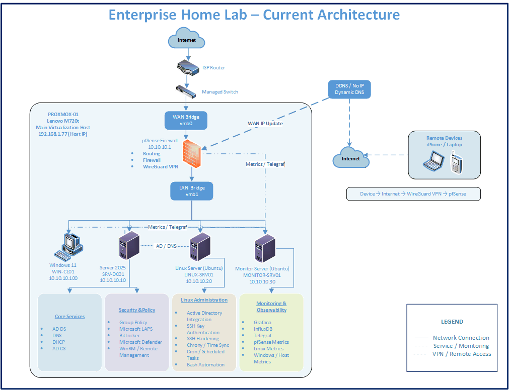

# 🏠 Enterprise Infrastructure HomeLab

> **A complete hands-on enterprise-style IT infrastructure lab — built, configured, secured, tested, monitored, troubleshot, recovered, and documented step-by-step.**

This repository documents the complete journey of building an **enterprise-style IT infrastructure HomeLab from the ground up**.

The environment combines virtualization, networking, Windows Server, Active Directory, Linux, security, VPN, monitoring, logging, alerting, automation, and eventually containerized services into one connected infrastructure.

The goal is not simply to install different technologies.

The goal is to understand **how they work together, how to configure them correctly, how to test them, and most importantly — how to troubleshoot them when something goes wrong.**

---

# 🎯 Who Is This HomeLab For?

If you are **new to IT**, studying System Administration, Networking, Infrastructure, or Security, and want real hands-on experience, you can follow this repository **from Stage 01 onward** and build your own environment.

Each stage explains not only **what to configure**, but also:

* 📖 What the technology is
* 🏢 Why it is used in enterprise environments
* 🛠️ How to install and configure it
* 💻 Commands used during configuration
* 🧠 What important commands actually do
* 📸 Screenshots from the real lab
* 🧪 How to test and validate the configuration
* ⚠️ Problems encountered during implementation
* 🔍 Troubleshooting and investigation steps
* ✅ How the problem was resolved
* 💡 What was learned from the issue
* 🏢 Practical enterprise use cases

You do not have to build the complete lab either.

If you are searching for a solution to a particular **Proxmox, pfSense, Windows Server, Active Directory, Linux, VPN, DNS, monitoring, or infrastructure problem**, check the relevant stage and its troubleshooting section to see whether I encountered and solved a similar issue.

---

# 🧭 How This Project Works

The HomeLab follows a practical infrastructure learning cycle:

```text
                    PLAN
                      │
                      ▼
                   DEPLOY
                      │
                      ▼
                  CONFIGURE
                      │
                      ▼
                    SECURE
                      │
                      ▼
                     TEST
                      │
                      ▼
                TROUBLESHOOT
                      │
                      ▼
                   RECOVER
                      │
                      ▼
                  DOCUMENT
                      │
                      ▼
                   IMPROVE
```

A successful installation is only part of infrastructure administration.

Understanding **why something failed, finding the root cause, fixing it, and verifying the solution** is just as important.

For this reason, troubleshooting is intentionally included throughout this repository.

---

# 🏗️ Current HomeLab Architecture

The HomeLab is designed as a small enterprise-style infrastructure environment.



---

# 🖥️ HomeLab Hardware

| Hardware                   | Purpose                                             |
| -------------------------- | --------------------------------------------------- |
| **Lenovo M720t**           | Primary Proxmox VE virtualization server            |
| **Lenovo M910q Mini PCs**  | Available for future multi-node / cluster expansion |
| **Managed Network Switch** | Physical network connectivity                       |
| **Lenovo T490**            | Administrative / client system                      |
| **Additional Storage**     | VM backup and infrastructure storage                |

---

# 🌐 Core Infrastructure

The environment currently combines:

| Area               | Technologies                                                   |
| ------------------ | -------------------------------------------------------------- |
| **Virtualization** | Proxmox VE • Virtual Machines • Linux Bridges                  |
| **Networking**     | pfSense • LAN/WAN • NAT • DNS • DDNS                           |
| **Remote Access**  | WireGuard VPN                                                  |
| **Windows**        | Windows Server 2025 • Windows 11                               |
| **Identity**       | Active Directory • AD Groups • SSSD • Kerberos                 |
| **Core Services**  | DNS • DHCP • Group Policy                                      |
| **Linux**          | Ubuntu • SSH • systemd • LVM • UFW • Samba                     |
| **Security**       | LAPS • BitLocker • Defender • Windows Firewall • SSH Hardening |
| **Monitoring**     | Prometheus • Grafana • Alertmanager                            |
| **Metrics**        | Node Exporter • Windows Exporter • Blackbox Exporter           |
| **Logging**        | Loki • Promtail • Windows Event Forwarding • Sysmon            |
| **Automation**     | PowerShell • Bash • Cron                                       |
| **Next Layer**     | Docker • Docker Compose • Containers                           |

---

# 📚 Build the HomeLab Step-by-Step

The project is divided into stages so the environment can be built progressively.

| Stage  | Project                          | Status      |
| ------ | -------------------------------- | ----------- |
| **01** | 🖥️ Proxmox Virtualization       | ✅ Completed |
| **02** | 🔥 pfSense Firewall & Networking | ✅ Completed |
| **03** | 🪟 Windows Server 2025           | ✅ Completed |
| **04** | 👥 Active Directory              | ✅ Completed |
| **05** | 🐧 Linux Administration          | ✅ Completed |
| **06** | 📊 Monitoring & Observability    | ✅ Completed |
| **07** | 🐳 Docker & Containers           | 🔜 Next     |
| **08** | 💾 Storage & File Services       | 📋 Planned  |
| **09** | 🛡️ Security & SIEM              | 📋 Planned  |
| **10** | ⚙️ Automation & Scripting        | 📋 Planned  |
| **11** | ♻️ Backup & Disaster Recovery    | 📋 Planned  |
| **12** | 🌐 Advanced Networking           | 📋 Planned  |

---

# 01 — 🖥️ Proxmox Virtualization

The first stage builds the virtualization foundation used to host the rest of the infrastructure.

### Covered

* Proxmox VE installation
* Host configuration
* Virtual machines
* Virtual networking
* Linux bridges
* VM storage
* Backup storage
* VM management
* Network troubleshooting

📂 **Documentation:** [`01-proxmox/`](01-proxmox/)

---

# 02 — 🔥 pfSense Firewall & Networking

pfSense provides routing, firewalling, network control, DNS services, and secure remote access to the HomeLab.

### Covered

* pfSense deployment
* WAN and LAN interfaces
* Firewall rules
* Network aliases
* NAT / Port Forwarding
* DNS
* Dynamic DNS
* No-IP DDNS
* WireGuard VPN
* Remote HomeLab access
* Internal DNS over VPN
* Firewall testing
* Network troubleshooting

📂 **Documentation:** [`02-pfsense/`](02-pfsense/)

---

# 03 — 🪟 Windows Server 2025

Windows Server provides the main Microsoft infrastructure services used throughout the environment.

### Covered

* Windows Server 2025 deployment
* Server networking
* DNS
* DHCP
* Group Policy
* Active Directory Certificate Services
* WinRM / remote administration
* Microsoft LAPS
* BitLocker policies
* Microsoft Defender
* Windows Firewall policies
* Sysmon
* Windows Event Forwarding
* Windows Server Backup
* Backup testing
* Restore and recovery
* Troubleshooting

📂 **Documentation:** [`03-windows-server-2025/`](03-windows-server-2025/)

---

# 04 — 👥 Active Directory

An enterprise-style Active Directory environment provides centralized identity, authentication, authorization, and policy management.

### Covered

* Active Directory Domain Services
* Domain configuration
* Organizational Unit design
* Users and security groups
* Administrative accounts
* AGDLP
* Delegation
* Group Policy
* Password policies
* Fine-Grained Password Policies
* Active Directory Sites & Services
* FSMO roles
* AD health validation
* Active Directory Recycle Bin
* gMSA
* PowerShell administration
* Windows 11 domain joining
* Troubleshooting

📂 **Documentation:** [`04-active-directory/`](04-active-directory/)

---

# 05 — 🐧 Linux Administration

Ubuntu Linux was introduced into the Windows-based infrastructure and integrated with Active Directory.

### Covered

* Linux installation
* Static networking
* Internal DNS
* Users and groups
* File and directory permissions
* sudo / least privilege
* APT package management
* systemd
* SSH administration
* Ed25519 key authentication
* SSH hardening
* LVM storage
* Linux logging
* `journalctl`
* Bash scripting
* Cron automation
* UFW firewall
* Samba / SMB
* Windows ↔ Linux interoperability
* Active Directory integration
* SSSD
* Kerberos
* AD-based Linux authentication
* AD security group login control
* AD-controlled sudo permissions
* Troubleshooting

### Key Outcome

Linux authentication and administrative access can be centrally controlled using Active Directory security groups.

📂 **Documentation:** [`05-Linux Administration/`](05-Linux%20Administration/)

---

# 06 — 📊 Monitoring & Observability

A centralized monitoring platform provides visibility into the health and availability of the infrastructure.

### Monitoring Stack

```text
Infrastructure
      │
      ├── Proxmox
      ├── pfSense
      ├── Windows Server
      ├── Windows 11
      └── Linux
             │
             ▼
         Exporters
             │
             ▼
        Prometheus
             │
       ┌─────┴─────┐
       │           │
    Grafana    Alertmanager
       │           │
  Dashboards     Alerts
```

### Covered

* Dedicated monitoring server
* Prometheus
* Grafana
* Alertmanager
* Node Exporter
* Windows Exporter
* Blackbox Exporter
* Proxmox monitoring
* pfSense monitoring
* Windows monitoring
* Linux monitoring
* CPU monitoring
* Memory monitoring
* Disk monitoring
* Network monitoring
* Infrastructure availability
* Prometheus alert rules
* Email notifications
* Loki
* Promtail
* Centralized log visibility
* Controlled failure testing
* Alert validation
* Recovery validation
* Monitoring troubleshooting

### Key Outcome

The infrastructure can now be centrally monitored to detect service failures and resource problems instead of relying only on manual checks.

📂 **Documentation:** [`06-monitoring-observability/`](06-monitoring-observability/)

---

# 🔍 Real Troubleshooting — Not Just Successful Configurations

One of the most important parts of this project is documenting **what did not work**.

Real infrastructure rarely works perfectly on the first attempt.

Problems encountered during the HomeLab build are converted into structured troubleshooting cases:

```text
Problem
   ↓
Symptoms
   ↓
Investigation
   ↓
Root Cause
   ↓
Solution
   ↓
Verification
   ↓
Lesson Learned
```

Examples of issues investigated during this project include:

* Proxmox network bridge configuration
* pfSense WAN addressing / interface problems
* Firewall rule behavior
* NAT configuration
* Internal DNS resolution
* DNS resolution through WireGuard
* Windows Certificate Authority connectivity
* Windows Event Forwarding receiving no events
* Linux DNS configuration
* Linux time synchronization
* SSH authentication and hardening
* Linux Active Directory integration
* Windows/Linux authentication
* Monitoring target connectivity
* Exporter configuration
* Telegraf service problems
* Grafana dashboard configuration
* Prometheus alert configuration
* Alertmanager testing
* Infrastructure failure and recovery validation

These troubleshooting sections can also be used independently.

If you encounter a similar problem, navigate directly to the related technology and check the troubleshooting documentation.

---

# 🧪 Testing & Validation

Configurations are not considered complete simply because they were installed.

Where applicable, each stage includes validation such as:

* Connectivity testing
* DNS resolution
* Authentication testing
* Permission validation
* Firewall testing
* VPN connectivity
* Remote administration
* Group Policy verification
* Backup and restore testing
* Monitoring target validation
* Alert simulation
* Service failure simulation
* Recovery verification

This helps confirm that the configuration actually works as intended.

---

# 🔐 Security Approach

Security controls are introduced throughout the environment rather than treated as a single separate task.

Examples include:

* pfSense firewall policies
* Network segmentation concepts
* WireGuard remote access
* Active Directory security groups
* Least-privilege administration
* Group Policy
* Microsoft LAPS
* BitLocker policies
* Microsoft Defender
* Windows Firewall
* SSH key authentication
* Disabled SSH root login
* Disabled SSH password authentication
* UFW
* AD-controlled Linux access
* Logging and monitoring

---

# 🚧 Current Stage

## 07 — 🐳 Docker & Containers

The next stage introduces containerized workloads into the existing infrastructure.

Planned topics include:

* Docker Engine
* Images and containers
* Registries
* Docker networking
* Persistent volumes
* Dockerfiles
* Custom images
* Docker Compose
* Multi-container applications
* Restart policies
* Container security
* Container troubleshooting
* Monitoring Docker workloads using the existing Prometheus and Grafana platform

This will introduce a modern application deployment layer while continuing to use the networking, identity, security, and monitoring foundations already built.

---

# 📂 Repository Structure

```text
enterprise-homelab/
│
├── README.md
│
├── 01-proxmox/
│
├── 02-pfsense/
│
├── 03-windows-server-2025/
│
├── 04-active-directory/
│
├── 05-Linux Administration/
│
├── 06-monitoring-observability/
│
└── docs/
    └── architecture/
```

As the HomeLab grows, additional stages and troubleshooting documentation will be added.

---

# 🔐 Security Notice

This repository documents a **controlled HomeLab environment**.

Sensitive information is not published.

Passwords, private keys, VPN credentials, recovery keys, tokens, certificates, and other sensitive administrative information are removed, masked, or replaced with example values.

IP addresses and hostnames shown throughout the documentation relate to the isolated lab environment.

---

# 🤝 Using This Repository

There are two ways to use this project.

### 🏗️ Build From Scratch

Start with **Stage 01 — Proxmox** and continue through each stage.

This allows you to progressively build virtualization, networking, Windows infrastructure, identity, Linux, security, monitoring, and eventually container services.

### 🔎 Find a Solution

Already have your own environment?

Navigate directly to the relevant technology or troubleshooting section.

You may find the commands, investigation process, root cause, or solution useful when diagnosing a similar issue.

---

# 👤 Author

**Mohamed Afham**

This repository documents my ongoing hands-on journey of building, testing, troubleshooting, securing, monitoring, and improving an enterprise-style IT infrastructure environment.

---

> ## 🧠 Learn → Build → Break → Troubleshoot → Fix → Understand → Improve
>
> **The objective is not only to make the technology work — it is to understand why it works and know what to do when it doesn't.**
